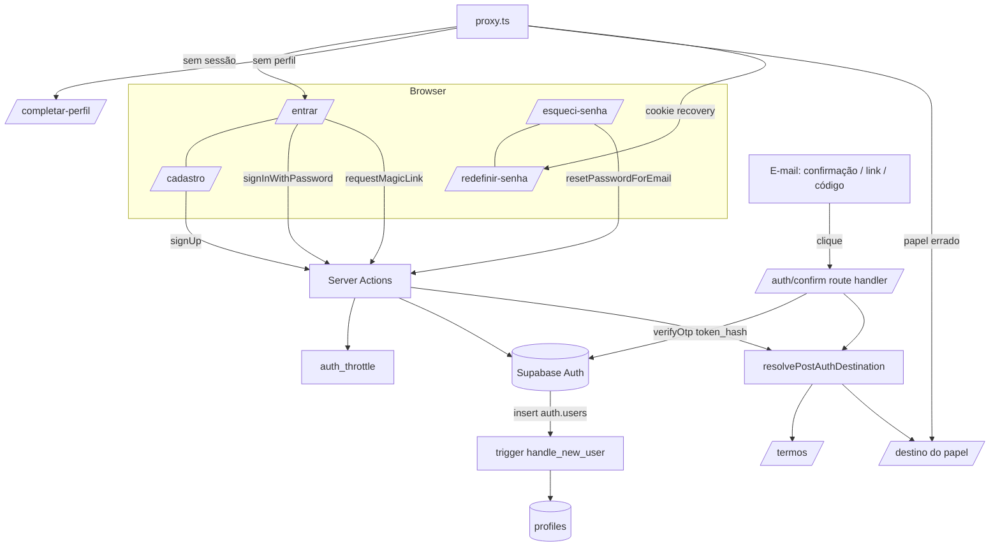
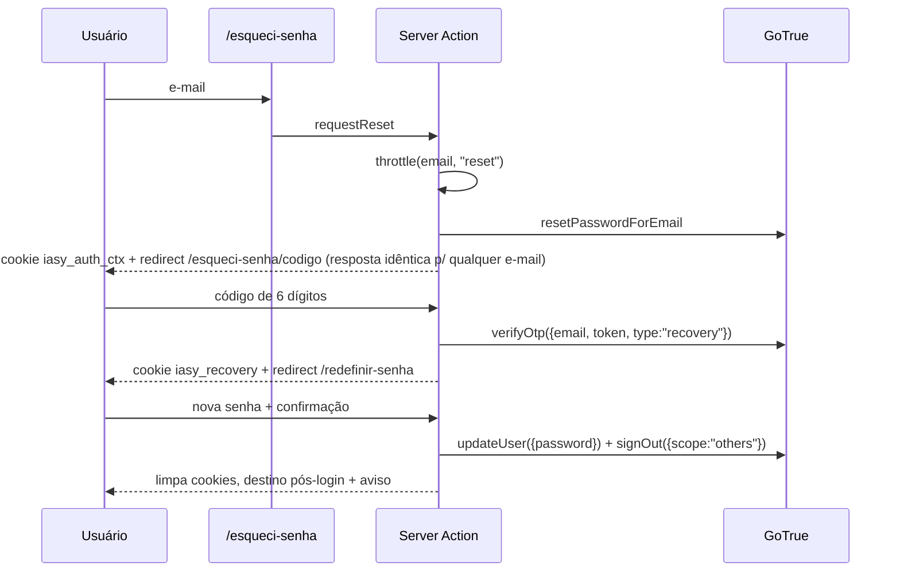

# Login com e-mail e senha, magic link e reset de senha — Design

**Spec**: `.specs/features/login-e-reset-de-senha/spec.md`
**Status**: Draft
**Convenção de caminhos**: todo caminho é relativo a `web/` (AD-008); gates rodam com `cwd=web/`.

Restrições ativas de `.specs/STATE.md`: AD-001 (rotas por route group de perfil), AD-004 (Supabase Auth + `@supabase/ssr`, sem lib de auth extra), AD-005 (RLS como fonte da verdade, `proxy` só para UX), AD-006 (shadcn/ui + tokens), AD-008 (código em `/web`). O design **conforma** todas. AD-004 trazia como razão "OTP resolve a entrada sem senha"; a decisão (provedor) segue válida, a razão mudou. Os novos padrões entram como AD-009 e AD-010 (final do documento).

---

## Approach Exploration

Quatro decisões estruturais. A stack não é reaberta.

### 1. Como o link do e-mail vira sessão

| Abordagem | Descrição | Trade-off |
| --- | --- | --- |
| **A — `token_hash` + `verifyOtp` em route handler (recomendada)** | O template monta `/auth/confirm?token_hash=…&type=…&next=…`; o handler chama `verifyOtp({ token_hash, type })` no servidor e grava os cookies | Funciona em outro aparelho/navegador (AUTH-04.10, AUTH-06/07); padrão SSR do Supabase; exige template próprio |
| B — PKCE `code` + `exchangeCodeForSession` | Usa `{{ .ConfirmationURL }}` e um `/auth/callback` | O `code_verifier` fica no navegador que pediu o link: quebra quando o produtor pede no celular e abre em outro aparelho |

Escolha: **A**. Requisito direto do AUTH-07.4 (sessão "em qualquer navegador").

### 2. Onde o perfil é criado

| Abordagem | Descrição | Trade-off |
| --- | --- | --- |
| **A — trigger `after insert on auth.users` (recomendada)** | Lê `raw_user_meta_data.role/nome`, valida e insere em `profiles` | Vale para todo caminho (confirmação, link, admin); atômico; testável em SQL |
| B — upsert no handler de cada caminho | Como `verifyOtp` faz hoje | Cada novo caminho precisa lembrar; é exatamente o G3 |

Escolha: **A**. Regra do trigger: `role` ausente → não cria (usuário fica "órfão" e cai em Complete seu perfil); `role` presente e inválido (inclui `verificador`) → `raise exception` e o cadastro falha (AUTH-11).

### 3. Como carregar e-mail entre telas sem pô-lo na URL

| Abordagem | Descrição | Trade-off |
| --- | --- | --- |
| **A — cookie httpOnly assinado, 15 min (recomendada)** | `iasy_auth_ctx` com `{ email, kind, exp }` assinado por HMAC; as páginas de "confirmar e-mail", "link enviado" e "código" o leem no servidor | Sem PII em URL/histórico/referer; funciona sem JS; precisa de segredo (`AUTH_COOKIE_SECRET`) |
| B — `sessionStorage` | Cliente guarda o e-mail | Páginas servidas por Server Component não leem; some em nova aba |
| C — query string (MVP) | `?email=` | G9 |

Escolha: **A**.

### 4. Limite de reenvio (3 por hora) e cooldown de 60 s

| Abordagem | Descrição | Trade-off |
| --- | --- | --- |
| **A — tabela `auth_throttle` consultada pela server action (recomendada)** | Chave = SHA-256 do e-mail normalizado + `kind`; conta linhas na última hora | Independe de plano/config do Supabase; cobre também e-mail inexistente (antienumeração) |
| B — só `max_frequency` e rate limits do GoTrue | Zero código | `max_frequency` é por usuário existente (não cobre e-mail inexistente) e não existe o teto "3 por hora" do spec |

Escolha: **A**, **somente** para envio/reenvio de e-mail (cadastro, confirmação, magic link, reset). Tentativas de **código/senha** seguem nos limites nativos do GoTrue (premissa Q4 da spec, inalterada).

---

## Architecture Overview



**Fluxo de reset (OTP)**



**Ordem do destino pós-login** (função única, AUTH-01): perfil ausente → `/completar-perfil`; termos pendentes → `/termos`; migração do cookie de respostas; `redirect` válido e permitido → ele; senão destino padrão do papel.

---

## Code Reuse Analysis

### Existing Components to Leverage

| Component | Location | How to Use |
| --- | --- | --- |
| `resolvePostLoginRedirect` | `app/(marketing)/entrar/redirect.ts` | Mantém a lógica de destino padrão; **move** para `lib/auth/redirect.ts` e é chamada por `resolvePostAuthDestination` |
| `isSafeRedirect` | idem | Reescrita (AUTH-01.4) no novo local; mesmo nome e assinatura |
| `resolveAccess` / `ROUTE_ACCESS` | `lib/auth/roles.ts` | Reutilizada para validar o `redirect` pelo papel; regra do produtor passa a excluir `/produtor` exato |
| `getCurrentRole` | `lib/auth/current-role.ts` | Inalterado; `AppChrome` continua usando |
| `migrateCookieAnswersToProfile` | `app/(investor)/descobrir/actions.ts` | Chamada por `resolvePostAuthDestination` (RN-23); funciona em route handler (`cookies()`) |
| `acceptTerms` | `app/(marketing)/termos/actions.ts` | Só atualiza import de `redirect.ts`; passa a chamar `resolvePostAuthDestination` |
| `updateSession` | `lib/supabase/middleware.ts` | Inalterado |
| `createServerClient` / `createAdminClient` | `lib/supabase/{server,admin}.ts` | Usados nas actions e no handler |
| `trackEvent` | `lib/analytics/track.ts` | Eventos AUTH-15 (tipos novos em `ProductEventType`) |
| `sendEmail` | `lib/notifications/send-email.ts` | Aviso de cadastro duplicado (hoje só `console.log`, ver Riscos) |
| `Button`, `Input`, `Typography`, `Card` | `components/ui/*` | Todas as telas novas (AD-006) |
| `AppChrome`, `SiteHeader`, `MobileBottomNav`, `components/producer/BottomNav.tsx` | `components/shared/*`, `components/producer/*` | Recebem "Sair" e a variante de chrome mínimo |
| Helpers de E2E (Mailpit) | `e2e/helpers/auth.ts`, `e2e/helpers/db.ts` | Passam a criar usuário por senha; leitura de e-mail do Mailpit reaproveitada para extrair link e código |
| Teste de config | `lib/auth/__tests__/otp-config.test.ts` | Padrão para travar chaves novas do `config.toml` (AUTH-02.16) |

### Integration Points

| System | Integration Method |
| --- | --- |
| Supabase Auth (GoTrue) | `signUp`, `signInWithPassword`, `signInWithOtp({shouldCreateUser:false})`, `resend`, `resetPasswordForEmail`, `verifyOtp`, `updateUser`, `signOut` |
| Postgres | Trigger em `auth.users`; tabela `auth_throttle`; função `email_account_status`; CHECK de `events.type` |
| Mailpit (dev) / SMTP (prod) | Templates em `supabase/templates/`; produção depende de DEPLOY.md §0.2/0.3 |
| Vercel | `site_url`, `additional_redirect_urls`, `AUTH_COOKIE_SECRET` por ambiente |

---

## Components

### `lib/auth/redirect.ts` (movido)

- **Purpose**: validar caminho de redirect e resolver o destino padrão do papel.
- **Location**: `lib/auth/redirect.ts` (tipos `EntrarRole`, `ProfileRole` vão junto)
- **Interfaces**:
  - `isSafeRedirect(path: string): boolean` — `/` seguido de char que não seja `/` ou `\`; decodifica uma vez e revalida; rejeita controle (`\x00-\x1f`, `\x7f`); rejeita prefixos `/entrar`, `/cadastro`, `/esqueci-senha`, `/redefinir-senha`, `/completar-perfil`, `/auth/`.
  - `normalizeNext(raw: string | string[] | null, origin: string): string | null` — aceita URL absoluta só da mesma origem (extrai `pathname+search`), usa o primeiro valor de lista, aplica `isSafeRedirect`.
  - `resolvePostLoginRedirect(admin, userId, role): Promise<string>` — inalterada.
  - `roleHome(role): string` — `/verificacao`, `/produtor`, `/negocios` (usada pelo `proxy`, sem consulta a banco).
- **Reuses**: código atual de `entrar/redirect.ts`.

### `lib/auth/post-auth.ts`

- **Purpose**: único ponto de decisão do destino após qualquer autenticação (AUTH-01).
- **Interfaces**:
  - `resolvePostAuthDestination(deps, { userId, requested }): Promise<string>`
    - `deps = { getProfile, hasAcceptedTerms, migrateAnswers, resolveDefault }` (injeção para teste puro).
    - Ordem: sem perfil → `/completar-perfil?redirect=…`; investidor/empresa sem termos → `/termos?redirect=…` (após `migrateAnswers`); `requested` seguro **e** `resolveAccess(requested, role).allowed` → `requested`; senão `resolveDefault`.
- **Dependencies**: `redirect.ts`, `roles.ts`, `migrateCookieAnswersToProfile`.
- **Reuses**: a sequência hoje embutida em `verifyOtp`.

### `lib/auth/password.ts`

- **Purpose**: regra de senha única (cliente e servidor).
- **Interfaces**: `validatePassword(pw: string): { ok: boolean; missing: ("min"|"max"|"letter"|"digit")[] }`; `passwordRequirementMessage(missing)`.
- **Reuses**: nada (função pura; mesma lógica que `letters_digits` do GoTrue).

### `lib/auth/auth-context-cookie.ts`

- **Purpose**: cookie httpOnly assinado que leva e-mail entre telas (decisão 3) e o cookie de sessão de recuperação.
- **Interfaces**:
  - `setAuthContext(input: { email: string; kind: "signup" | "magic" | "reset" }): Promise<void>` — `iasy_auth_ctx`, 15 min, `httpOnly`, `secure` em produção, `sameSite=lax`, valor `base64url(payload).hmac`.
  - `readAuthContext(kind): Promise<{ email: string } | null>` — valida HMAC e `exp`.
  - `setRecoveryFlag()` / `hasRecoveryFlag(request)` / `clearRecoveryFlag()` — `iasy_recovery`, 15 min.
- **Dependencies**: `node:crypto`, `AUTH_COOKIE_SECRET` (obrigatória; falha na inicialização se ausente em produção).

### `lib/auth/throttle.ts`

- **Purpose**: cooldown de 60 s e teto de 3 envios/hora por e-mail e `kind` (AUTH-09).
- **Interfaces**: `checkAndRecordSend(email, kind): Promise<{ allowed: true } | { allowed: false; retryAfterSec: number }>` — admin client; remove linhas com mais de 1 h a cada gravação.
- **Dependencies**: tabela `auth_throttle`; `normalizeEmail`.

### `lib/auth/email.ts`

- **Purpose**: normalização (`trim` + minúsculas) e hash de chave.
- **Interfaces**: `normalizeEmail(raw: string): string`, `hashEmail(email: string): string`.

### `app/auth/confirm/route.ts`

- **Purpose**: troca `token_hash` por sessão para confirmação de cadastro e magic link (AUTH-04, AUTH-07).
- **Interfaces**: `GET(request)`: lê `token_hash`, `type`, `next`; `type ∈ {signup, email}` (a PRD também previa `recovery`, mas reset usa OTP, então `recovery` **não** é aceito neste handler); `verifyOtp({ token_hash, type })`; sucesso → `resolvePostAuthDestination` → redirect; erro → `/cadastro/confirmar-email?erro=expirado` (signup) ou `/entrar?erro=link-expirado` (email).
- **Dependencies**: `createServerClient`, `post-auth.ts`, `normalizeNext`.
- **Nota**: o spec, AUTH-04.12, lista `recovery` entre os tipos permitidos; ver **Spec amendments** (abaixo) — a lista final é `signup` e `email`.

### Páginas e server actions (por rota)

Todas em `app/(marketing)/…` (AD-001), padrão atual: `page.tsx` (Server Component, lê `searchParams` e cookies) + `*-form.tsx` (client, `useActionState`) + `actions.ts`.

| Rota | Arquivos | Actions e comportamento |
| --- | --- | --- |
| `/entrar` | `entrar/page.tsx`, `entrar-form.tsx`, `entrar/actions.ts` | `signInPassword`: valida, `signInWithPassword`, mapeia erros por `error.code` (`invalid_credentials` → AUTH-05.3; `email_not_confirmed` → AUTH-05.4; status 429/`over_request_rate_limit` → AUTH-05.13), `trackEvent`, `resolvePostAuthDestination`. `requestMagicLink`: throttle `magic`, `signInWithOtp({ shouldCreateUser:false, emailRedirectTo })`, **engole** o erro "signups not allowed" (antienumeração), cookie ctx, redirect `/entrar/link-enviado`. `page.tsx` redireciona usuário já logado (AUTH-01.9) |
| `/entrar/link-enviado` | `link-enviado/page.tsx`, `reenviar-form.tsx` | Lê ctx; `resendMagicLink` (throttle) |
| `/entrar/codigo` | — | **Removido**; `next.config.ts` `redirects()` 308 → `/entrar` |
| `/cadastro` | `cadastro/page.tsx`, `cadastro-form.tsx`, `cadastro/actions.ts` | `signUpAction`: valida (senha, nome, perfil, e-mail), throttle `signup`, `email_account_status` → `none`: `signUp({ email, password, options:{ data:{ role, nome }, emailRedirectTo } })`; `confirmed`: não chama `signUp`, `sendEmail` de aviso; `unconfirmed`: `resend({type:"signup"})`. Todos: cookie ctx + redirect `/cadastro/confirmar-email` |
| `/cadastro/confirmar-email` | `confirmar-email/page.tsx`, `reenviar-form.tsx` | Lê ctx; `resendConfirmation` (throttle `signup`, `resend({ type:"signup", email })`); `?erro=expirado` |
| `/auth/confirm` | `app/auth/confirm/route.ts` | ver acima |
| `/esqueci-senha` | `page.tsx`, `form.tsx`, `actions.ts` | `requestReset`: throttle `reset`, `resetPasswordForEmail(email)`, ctx, redirect `/esqueci-senha/codigo` (sempre) |
| `/esqueci-senha/codigo` | `codigo/page.tsx`, `codigo-form.tsx` | `verifyResetCode`: `verifyOtp({ email, token, type:"recovery" })` (token sem espaços); erro genérico (AUTH-08.6); 429 → AUTH-08.8; sucesso → `setRecoveryFlag` + redirect `/redefinir-senha`. `resendResetCode` (throttle) |
| `/redefinir-senha` | `page.tsx`, `form.tsx`, `actions.ts` | `page.tsx` exige sessão (`getUser`) senão `/esqueci-senha`. `setNewPassword`: `validatePassword`, `updateUser({ password })` (erro `same_password` → AUTH-14.13), `signOut({ scope:"others" })`, `clearRecoveryFlag`, `trackEvent`, `resolvePostAuthDestination` + `?aviso=senha-alterada` |
| `/completar-perfil` | `page.tsx`, `form.tsx`, `actions.ts` | `completeProfile`: valida perfil e nome, `insert` em `profiles` com o cliente do usuário (policy `profiles_insert_own` bloqueia `verificador`), destino via `resolvePostAuthDestination` |
| Logout | `lib/auth/sign-out.ts` (`"use server"`) | `signOutAction`: `signOut()`, limpa `iasy_recovery`/`iasy_auth_ctx`, `trackEvent("logout")`, `redirect("/")` |

- **Dependencies comuns**: `createServerClient`, `trackEvent`, `throttle.ts`, `auth-context-cookie.ts`, `password.ts`, `email.ts`.
- **Reuses**: `Typography`, `Button`, `Input`, `Card`; mesmo padrão de `useActionState` do `entrar-form.tsx` atual.

### Chrome e navegação

- **`components/shared/AppChrome.tsx`**: novo conjunto `AUTH_PATTERNS = [/^\/entrar/, /^\/cadastro/, /^\/esqueci-senha/, /^\/redefinir-senha/, /^\/completar-perfil/, /^\/auth\//]` → renderiza `AuthChrome` (logo com link para `/` + `children`), sem `SiteHeader` completo, sem `FixedLegalBanner` e sem `MobileBottomNav` (AUTH-05.11).
- **`components/shared/SiteHeader.tsx`**: quando `role` não for `null`, troca o link "Entrar" por um `<form action={signOutAction}>` com botão "Sair"; CTAs de "Para produtores" apontam a `/produtor` (agora público).
- **`components/shared/MobileBottomNav.tsx`** e **`components/producer/BottomNav.tsx`**: item "Sair" (form com `signOutAction`).
- **`app/(marketing)/page.tsx`**: CTAs passam a `/cadastro?perfil=produtor` e `/cadastro?perfil=investidor`.
- **Banner de aviso**: `AppChrome` (client) lê `useSearchParams()` e exibe `?aviso=sem-permissao` como faixa dispensável; em rotas sem chrome (produtor, verificador) o redirect acontece sem faixa (ver Spec amendments).

### `proxy.ts` (alterado)

- **Purpose**: guard de UX por papel, perfil ausente e sessão de recuperação.
- **Mudanças**:
  1. `getRole` passa a devolver `{ userId: string | null; role: Role | null }` (perfil ausente ≠ sem sessão).
  2. Usuário logado **sem** perfil em rota privada, `/entrar` ou `/cadastro` → redirect `/completar-perfil` (AUTH-11.8).
  3. Sem sessão em rota privada → `/entrar?redirect=<path+search>` (como hoje).
  4. Papel errado em rota de página → redirect `roleHome(role)?aviso=sem-permissao`; JSON 403 só se `pathname.startsWith("/api/")` (AUTH-01.7).
  5. Cookie `iasy_recovery` presente e caminho fora de `{/redefinir-senha, /esqueci-senha*, /auth/*}` e fora de assets → redirect `/redefinir-senha` (AUTH-14.16).
- **Reuses**: `resolveAccess`, `updateSession`.

### `lib/auth/roles.ts` (alterado)

- Regra do produtor: `^/produtor/(cadastro|painel|pedidos|interesses)(/|$)` em vez de `^/produtor(/|$)`; `/produtor` exato e `/produtor/` ficam públicos (AUTH-17). Nenhuma outra rota pública nova em `/produtor/*` existe hoje (conferido em `ls app/(producer)/produtor`); a regra de allow-list acima é fail-closed: qualquer subrota nova de `/produtor` que não estiver na lista fica pública, então o teste de `roles.test.ts` lista as pastas atuais e quebra se aparecer uma pasta nova não coberta.

---

## Data Models

### Migração `0012_auth_profile_trigger.sql`

```sql
create function public.handle_new_user() returns trigger
language plpgsql security definer set search_path = public as $$
declare v_role text := new.raw_user_meta_data ->> 'role';
        v_nome text := nullif(btrim(new.raw_user_meta_data ->> 'nome'), '');
begin
  if v_role is null then return new; end if;               -- órfão: Complete seu perfil
  if v_role not in ('investidor','empresa','produtor') then
    raise exception 'role invalido: %', v_role;           -- inclui 'verificador'
  end if;
  insert into public.profiles (id, role, nome)
  values (new.id, v_role::public.role, coalesce(v_nome, split_part(new.email, '@', 1)))
  on conflict (id) do nothing;
  return new;
end $$;

create trigger on_auth_user_created after insert on auth.users
  for each row execute function public.handle_new_user();
```

`seed.sql` e usuários criados por service role sem `role` no metadado não são afetados (`v_role is null`). `revoke all … from public` na função.

### Migração `0013_auth_throttle.sql`

```sql
create table public.auth_throttle (
  id bigint generated always as identity primary key,
  key_hash text not null,          -- sha256(email normalizado)
  kind text not null check (kind in ('signup','magic','reset')),
  created_at timestamptz not null default now()
);
create index on public.auth_throttle (key_hash, kind, created_at desc);
alter table public.auth_throttle enable row level security;  -- sem policy: só service role

create function public.email_account_status(p_email text) returns text
language sql security definer set search_path = public, auth stable as $$
  select case when u.id is null then 'none'
              when u.email_confirmed_at is null then 'unconfirmed'
              else 'confirmed' end
  from (select 1) s left join auth.users u on lower(u.email) = lower(p_email)
$$;
revoke all on function public.email_account_status(text) from public, anon, authenticated;
grant execute on function public.email_account_status(text) to service_role;
```

### Migração `0014_events_auth_types.sql`

Recria o CHECK de `events.type` acrescentando (prefixo `auth_` para não colidir com `cadastro_enviado` do produtor): `auth_cadastro_enviado`, `auth_email_confirmado`, `auth_login_senha_ok`, `auth_login_senha_erro`, `auth_magic_link_pedido`, `auth_magic_link_ok`, `auth_reset_pedido`, `auth_reset_codigo_ok`, `auth_reset_codigo_erro`, `auth_senha_alterada`, `auth_logout`. `ProductEventType` ganha os mesmos literais. Payload: só `{ papel?: string }`, nunca e-mail/senha/token/código (AUTH-15.2).

### Cookies

| Cookie | Conteúdo | Validade | Quem lê |
| --- | --- | --- | --- |
| `iasy_auth_ctx` | `{ email, kind, exp }` assinado | 15 min | páginas de confirmar-email, link-enviado, código |
| `iasy_recovery` | `1` (assinado) | 15 min | `proxy.ts`, `/redefinir-senha` |

---

## Configuração (`supabase/config.toml` e templates)

| Chave / arquivo | Valor |
| --- | --- |
| `[auth] site_url` | por ambiente (local `http://127.0.0.1:3000`); produção em DEPLOY.md |
| `additional_redirect_urls` | `http://127.0.0.1:3000/**` local; domínios de produção/preview em DEPLOY.md |
| `[auth] minimum_password_length` / `password_requirements` | `8` / `"letters_digits"` |
| `[auth.email] enable_confirmations` | `true` |
| `max_frequency` | `"60s"` |
| `otp_expiry` | `600` (inalterado) |
| `[auth.email.template.confirmation]` | `supabase/templates/confirmation.html`, link `{{ .SiteURL }}/auth/confirm?token_hash={{ .TokenHash }}&type=signup&next={{ .RedirectTo }}` |
| `[auth.email.template.magic_link]` | só botão, `…&type=email&next={{ .RedirectTo }}` |
| `[auth.email.template.recovery]` | só `{{ .Token }}` |
| `[auth.email.notification.password_changed]` | `enabled = true`, template pt-BR |
| `[auth.rate_limit]` | `email_sent`, `sign_in_sign_ups`, `token_verifications`: mantêm valores de dev em `config.toml` (comentário "só dev") e valores de produção documentados em DEPLOY.md |

Teste `lib/auth/__tests__/auth-config.test.ts` trava `enable_confirmations`, `minimum_password_length`, `password_requirements`, `max_frequency` e a presença dos 3 templates, no mesmo padrão de `otp-config.test.ts`.

---

## Error Handling Strategy

| Error Scenario | Handling | User Impact |
| --- | --- | --- |
| `invalid_credentials` (também conta do MVP sem senha) | mensagem única | "E-mail ou senha incorretos." |
| `email_not_confirmed` | ação devolve `{ code: "unconfirmed" }` | Mensagem + botão de reenvio |
| 429 / `over_request_rate_limit` no login | mapeado | "Muitas tentativas. Aguarde alguns minutos…" |
| Throttle excedido (cooldown/teto) | `{ allowed:false }` | Mensagem de espera/teto; sem diferença por existência de conta |
| `signInWithOtp` com e-mail inexistente (`shouldCreateUser:false`) | erro engolido | Tela "link enviado" igual |
| Falha de SMTP em `signUp`/`resend`/`resetPasswordForEmail` | log no servidor, sem mensagem interna | "Não foi possível enviar o e-mail. Tente de novo." |
| Código de reset inválido, vencido, usado ou substituído | erro único do `verifyOtp` | "Código inválido ou vencido." |
| Limite de verificações do GoTrue | detectado por status 429 | "Muitas tentativas. Peça um novo código." |
| `same_password` no `updateUser` | mapeado | "Escolha uma senha diferente da atual." |
| Trigger rejeita `role` | `signUp` falha com erro de banco | Mensagem genérica de cadastro; nenhum usuário criado (transação) |
| `token_hash` vencido/usado em `/auth/confirm` | redirect por tipo | Telas de link expirado |
| `AUTH_COOKIE_SECRET` ausente em produção | falha ao assinar | Erro 500 explícito no log; coberto por teste de ambiente |
| `trackEvent` falha | `try/catch` e segue | Nenhum (AUTH-15.4) |

---

## Risks & Concerns

| Concern | Location | Impact | Mitigation |
| --- | --- | --- | --- |
| **`sendEmail` é stub** (`console.log`); aviso de cadastro duplicado (AUTH-03.7) não chega ao titular | `lib/notifications/send-email.ts:29` | AC não cumprível em produção sem transporte real | Aviso chama `sendEmail`; AC amendada para condicional (Spec amendments); dependência registrada em DEPLOY.md §0.2 |
| `proxy` consulta usuário + perfil em toda requisição (incluindo públicas) e o layout repete a consulta | `proxy.ts:6-31`, `lib/auth/current-role.ts` | Latência e carga de auth antes de qualquer página | Fora do escopo; novos checks (cookie, perfil ausente) reutilizam a mesma consulta, sem queries extras. Registrar para fase de performance |
| **Upsert de perfil dentro da action de OTP** é o único criador hoje | `app/(marketing)/entrar/actions.ts:113` | Sem esse caminho (removido) usuário nasce sem perfil | Trigger (decisão 2) + `/completar-perfil` para órfãos |
| Redirect aceita qualquer `/…` e honra antes do papel | `app/(marketing)/entrar/actions.ts:55,146`, `redirect.ts` | Open redirect residual + 403 JSON | Reescrita de `isSafeRedirect` + validação por `resolveAccess` (AUTH-01) |
| Regra do produtor cobre `/produtor/**` por prefixo | `lib/auth/roles.ts:18` | `/produtor` fica privado; allow-list nova pode deixar subrota nova pública | Teste que enumera as pastas de `app/(producer)/produtor` e falha em pasta não coberta |
| E2E dependem de login por OTP (dezenas de specs via `e2e/helpers/auth.ts`) | `e2e/helpers/auth.ts`, `e2e/entrar*.spec.ts` | Suíte inteira quebra ao remover OTP | Tarefa dedicada: helper de login por senha (cria usuário por admin API com `email_confirm:true`); feita **antes** de remover o OTP |
| Rate limits de auth do `config.toml` são de dev (1000) | `supabase/config.toml:231,247` | Produção sem limite real se o painel do Supabase não for ajustado | Documentar valores em DEPLOY.md e no checklist; teste de config trava o comentário/valores de dev apenas |
| `entrar/codigo` com testes e specs próprios | `app/(marketing)/entrar/codigo/__tests__`, `e2e/entrar-codigo.spec.ts` | Testes do fluxo removido | Reescrever/remover no mesmo commit da remoção |
| Dependência de comportamento do GoTrue não verificado em código local (`{{ .RedirectTo }}` no template, `error.code` `same_password`, 429 como `over_request_rate_limit`, `signUp` com e-mail existente e confirmação ligada não devolvendo erro) | `supabase/templates/*`, actions | Mapeamentos podem divergir | Primeira tarefa verifica na documentação (Context7/Supabase docs) e num teste de integração com o Supabase local; divergência ajusta o mapeamento, não o spec |
| `node_modules` ausente no worktree atual | — | Não foi possível ler os tipos instalados do `@supabase/auth-js` | Mesma verificação acima, depois de `npm ci` |

---

## Tech Decisions (only non-obvious ones)

| Decision | Choice | Rationale |
| --- | --- | --- |
| Verificação de link | `token_hash` em `/auth/confirm` (não PKCE) | Funciona em outro aparelho/navegador |
| Reset por OTP em vez de link | `type:"recovery"` + `verifyOtp({email, token})` | Pedido do produto; evita o problema de abrir link em outro app/aparelho |
| `type=recovery` fora de `/auth/confirm` | Handler aceita só `signup` e `email` | Reset é por código; aceitar `recovery` por link abriria um segundo caminho sem teto de tentativas próprio |
| Perfil | Trigger no banco | Todo caminho cria perfil igual (G3) |
| `role` ausente no metadado | Trigger não cria perfil | Compatível com seed e usuários criados pela equipe (verificador) |
| Cadastro com e-mail existente | Não chama `signUp`; usa `email_account_status` | O GoTrue não sinaliza duplicado com confirmação ligada, e não envia aviso ao titular |
| PII entre telas | Cookie httpOnly assinado | RNF-06 |
| Teto de reenvio | Tabela `auth_throttle` | Não existe no GoTrue; cobre e-mail inexistente |
| Sessão de recuperação restrita | Cookie `iasy_recovery` checado no `proxy` | O JWT de recuperação não se distingue de uma sessão normal sem inspecionar claims (não verificado); flag explícita é simples e testável |
| Destino padrão no `proxy` | `roleHome(role)` estático | O `proxy` não consulta `businesses`/`investor_answers` |
| Remoção do login por OTP | `/entrar/codigo` 308 → `/entrar` | Links antigos de e-mail/bookmark não quebram |

---

## GoTrue verification

Confirmado por `e2e/auth-gotrue-contract.spec.ts` contra o Supabase local (GoTrue v2.197.0, 2026-10-02):

| Premissa | Resultado |
| --- | --- |
| `{{ .RedirectTo }}` chega no e-mail | Sim, **URL-encoded** (`next=http%3a%2f%2f…`). O handler lê com `searchParams.get("next")` (já decodificado) e passa por `normalizeNext` |
| `signUp` com e-mail já confirmado | **Devolve erro `user_already_exists`** (não um usuário "ofuscado" como o design supunha) e não envia e-mail. O design não depende disso: a action consulta `email_account_status` antes e nunca chama `signUp` nesse caso |
| `signInWithOtp({ shouldCreateUser:false })` com e-mail inexistente | Devolve erro, não cria usuário e não envia e-mail; a action engole o erro |
| Link do magic link (`token_hash`, `type=email`) | `verifyOtp({ token_hash, type:"email" })` cria sessão em outro cliente; reuso do mesmo hash falha |
| Reset por OTP | E-mail traz 6 dígitos; `verifyOtp({ email, token, type:"recovery" })` cria sessão; `updateUser` com a mesma senha devolve `code = "same_password"`; e-mail inexistente não devolve erro nem envia |
| `signInWithPassword` | `email_not_confirmed` (não confirmado); `invalid_credentials` (senha errada e e-mail inexistente) |
| Política de senha | `weak_password` para senha curta ou sem dígito |
| `max_frequency` (60 s) no reenvio | O GoTrue devolve `over_email_send_rate_limit` (429) **só para e-mail com conta**: se a action mostrasse esse erro, revelaria a conta. `lib/auth/messages.ts#isEmailSendRateLimit` faz as actions de reset e magic link tratarem como envio normal; o cooldown visível é o do `auth_throttle` (que vale para qualquer e-mail). Consequência para E2E: pedir um 2º código para o mesmo usuário exige esperar 61 s |
| 429 / `over_request_rate_limit` | **Não verificado**: os rate limits locais estão em 1000. A action mapeia `status === 429` e `code === "over_request_rate_limit"` por precaução |

---

## Spec amendments (a aplicar em `spec.md`)

Decorrem de limites encontrados no código; mudam o texto, não o objetivo.

1. **AUTH-03 (cadastro, critério 7)**: dividir em (a) sempre: mesma tela de sucesso e nenhum usuário novo; (b) `WHERE` o `sendEmail` do app tiver transporte real configurado, `WHEN` e-mail confirmado já existe `THEN` enviar o aviso ao titular.
2. **AUTH-04 (critério 12)**: tipos aceitos em `/auth/confirm` = `signup` e `email` (remover `recovery`).
3. **AUTH-01 (critério 7)**: o destino do papel errado é a "página inicial do papel" (`/verificacao`, `/produtor`, `/negocios`); `?aviso=sem-permissao` só é exibido nas rotas com chrome.
4. **AUTH-11 (critério 8/9)**: usuário sem `role` no metadado não ganha perfil pelo trigger e cai em `/completar-perfil`; `role` inválido faz o cadastro falhar. Nova linha em "Assumptions".
5. **AUTH-09**: reenvio/teto de 3 por hora vale para cadastro, confirmação, magic link e reset, e é contado por e-mail+tipo (também para e-mail inexistente).

---

## Estratégia de testes (visão geral; detalhe em `tasks.md`)

| Camada | O que cobre |
| --- | --- |
| Vitest (puro) | `isSafeRedirect`, `normalizeNext`, `validatePassword`, `resolvePostAuthDestination` (papel × redirect × termos × perfil), `resolveAccess` (regra do produtor + enumeração de pastas), cookie assinado (adulteração, expiração), `throttle` (cooldown, teto, limpeza), mapeamento de erros das actions (mocks do Supabase, no padrão de `entrar/__tests__/actions.test.ts`) |
| SQL/Playwright (`e2e/rls-full.spec.ts`) | trigger: role válido cria perfil, `verificador` falha, ausente não cria; `auth_throttle` e `email_account_status` inacessíveis a `anon`/`authenticated` |
| Playwright + Mailpit | cadastro → confirmação em contexto limpo → destino; login por senha (ok, erro, não confirmado); magic link em outro contexto de navegador, link usado duas vezes, e-mail inexistente; reset completo e sessões antigas encerradas; redirect cruzado de papel; Sair; `/produtor` público; aviso de senha alterada |
| Config | `auth-config.test.ts` |
| Acessibilidade | `e2e/a11y-investor.spec.ts` ganha `/entrar`, `/cadastro`, `/esqueci-senha`, `/redefinir-senha` |

---

## Decisões de projeto a registrar em `.specs/STATE.md`

- **AD-009** — Login por e-mail+senha, magic link e reset por OTP com Supabase Auth; links de e-mail verificados por `token_hash` em `/auth/confirm`; perfil criado por trigger em `auth.users`; substitui a RN-02 do MVP; AD-004 permanece.
- **AD-010** — Nenhum dado pessoal em query string nos fluxos de auth (cookie httpOnly assinado `iasy_auth_ctx`); envio de e-mail de auth limitado por `auth_throttle`.
