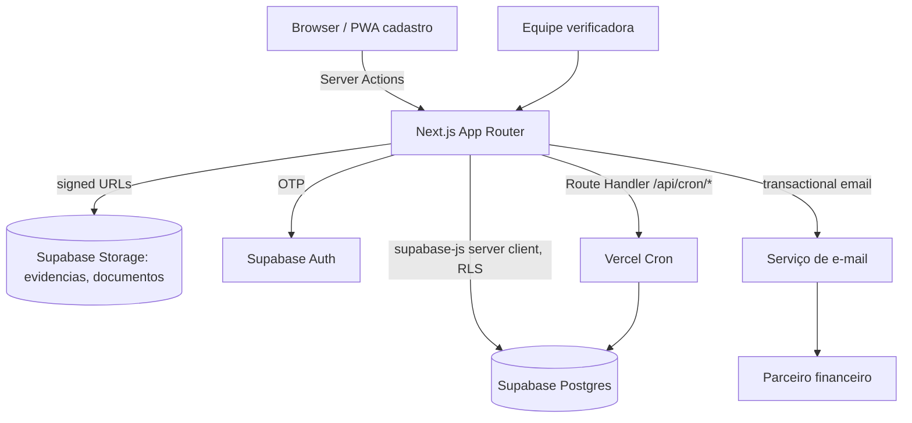
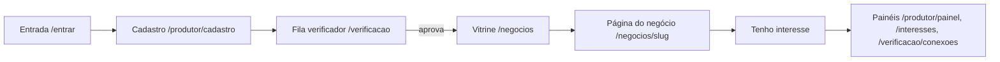

# Website MVP Îasy (Next.js) Design

**Spec**: `.specs/features/website-mvp/spec.md`
**Status**: Draft

Projeto greenfield: não há código de aplicação no repo hoje (só docs, PRD e protótipo estático). Não existe `.specs/STATE.md` ainda — este design cria a primeira leva de decisões de projeto (seção "Tech Decisions"), que vira o `## Decisions` inicial de `STATE.md` ao final desta sessão.

---

## Approach Exploration

Três decisões estruturais definem o resto do design. A stack (Next.js + Supabase + Vercel) já está fixada na PRD §7.2 — não é reaberta aqui.

### 1. Organização de pastas: por perfil vs. por camada técnica

| Abordagem | Descrição | Trade-off |
| --- | --- | --- |
| **A — por perfil (recomendada)** | `app/(marketing)`, `app/(investor)`, `app/(producer)`, `app/(verifier)` como route groups; lógica de domínio compartilhada em `lib/` | Espelha a PRD (M1–M7 por perfil), navegação e RLS por perfil ficam óbvias; times pequenos (1 dev) navegam rápido |
| B — por camada técnica | `app/`, `components/`, `services/`, `models/` sem separação por perfil | Comum em apps genéricos, mas aqui os 4 perfis têm rotas, permissões e mesmo layouts (mobile vs. desktop) totalmente distintos — misturar tudo em `components/` vira uma pasta única gigante |

**Recomendação**: A. É consistente com a estrutura de telas já numerada (COM, INV, PRO) na PRD e facilita aplicar RLS/guards por route group.

### 2. Cadastro do produtor offline-first: PWA custom vs. biblioteca de forms com persistência

| Abordagem | Descrição | Trade-off |
| --- | --- | --- |
| **A — Service worker mínimo + IndexedDB via `idb`, sync manual (recomendada)** | Cadastro T15–T21 registra um SW só para essas rotas; rascunho salvo em IndexedDB a cada campo, sincroniza com Supabase quando `navigator.onLine` | Escopo pequeno e auditável; atende exatamente RNF-01/RN-07 sem trazer um framework PWA inteiro |
| B | `next-pwa` cobrindo o app inteiro + `react-hook-form` com persistência genérica | Mais "grátis" no início, mas cacheia rotas que não precisam (vitrine, verificação) e complica invalidação de cache em produção |

**Recomendação**: A, escopado só às 5 telas do cadastro (RNF-01).

### 3. Cálculo de alinhamento (RN-24): função pura no client vs. no servidor

| Abordagem | Descrição | Trade-off |
| --- | --- | --- |
| **A — função pura em `lib/matching/score.ts`, chamada por Server Component/Route Handler (recomendada)** | Mesma função usada nos testes unitários (RNF-12) e na consulta que gera os resultados; não expõe a fórmula de pontuação no bundle do cliente | Mantém a fórmula auditável e testável isoladamente (CA-24.1 a CA-24.3), sem duplicar lógica |
| B | Calcular no client a partir de todos os negócios carregados | Vaza a fórmula de ranking no bundle e não escala quando a vitrine crescer além de dezenas de negócios |

**Recomendação**: A.

---

## Architecture Overview

Next.js App Router (Server Components por padrão, Client Components só onde há interação) rodando na Vercel; Supabase como backend único (Postgres + RLS, Auth OTP, Storage). Sem camada de backend separada — Server Actions e Route Handlers substituem uma API dedicada.



Fluxo de dados por módulo (M1–M7) segue a PRD §2.2; cada route group abaixo mapeia 1:1 a um módulo.



---

## Code Reuse Analysis

Repositório greenfield — nenhum código de aplicação a reaproveitar. O único artefato reutilizável é o próprio protótipo estático:

| Existing Component | Location | How to Use |
| --- | --- | --- |
| Tokens visuais (cor, tipografia, breakpoints) | `mvp/prd-mvp.md` §6.4 | Portar 1:1 para `tailwind.config.ts` (design tokens) em vez de redescobrir cores/fontes |
| Inventário de telas e rotas | `mvp/prd-mvp.md` §6.2, `mvp/telas.md` | Usar como mapa de rotas do App Router — os slugs `/produtor/cadastro/[parte]`, `/negocios/[slug]` etc. já estão definidos |
| Textos e microcopy | `mvp/prototipo.html` (visual), PRD | Reaproveitar a linguagem exata ("Busca R$ X", "Tenho interesse", rodapé de RN-04) para não reabrir decisões de copy já validadas |

### Integration Points

| System | Integration Method |
| --- | --- |
| Supabase Auth | `@supabase/ssr` com cookies httpOnly; OTP por e-mail; middleware do Next.js valida sessão em rotas privadas |
| Supabase Postgres | `@supabase/supabase-js` client por contexto (server component / server action) com RLS ativa em toda tabela (RNF-04) |
| Supabase Storage | Upload direto do client para bucket privado via URL assinada de upload; leitura via URL assinada de 5 min (RN-34) |
| Vercel Cron | Route Handler `/api/cron/daily` protegido por header secreto, roda 1x/dia (expira rascunhos RN-07, selos RN-19, pedidos RN-32/33, interesses RN-39) |
| E-mail transacional | Chamado de Server Action após eventos (código OTP é do próprio Supabase Auth; demais avisos via provedor com plano grátis) |

---

## Components

### `lib/supabase/{server,client,middleware}.ts`

- **Purpose**: Fábricas do cliente Supabase por contexto de execução (Server Component, Server Action/Route Handler, middleware, Client Component).
- **Location**: `lib/supabase/`
- **Interfaces**:
  - `createServerClient(): SupabaseClient` — usa cookies da requisição, para Server Components e Actions.
  - `createBrowserClient(): SupabaseClient` — para os poucos Client Components que precisam (uploader, formulário de cadastro offline).
  - `updateSession(request: NextRequest): NextResponse` — chamado pelo middleware para refresh de sessão.
- **Dependencies**: `@supabase/ssr`, `@supabase/supabase-js`.
- **Reuses**: n/a (primeira camada da aplicação).

### `middleware.ts` (raiz)

- **Purpose**: Redireciona para `/entrar` quando falta sessão em rota privada (RN-02, CA-02.3) e bloqueia rota de perfil errado (CA-01.2).
- **Location**: `middleware.ts`
- **Interfaces**: `middleware(request: NextRequest): NextResponse`.
- **Dependencies**: `lib/supabase/middleware.ts`, `lib/auth/roles.ts` (mapa rota → perfis permitidos).
- **Reuses**: —

### `lib/matching/score.ts`

- **Purpose**: Função pura que calcula o % de alinhamento (RN-24) entre respostas do investidor e um negócio.
- **Location**: `lib/matching/score.ts`
- **Interfaces**:
  - `calculateAlignment(answers: InvestorAnswers, business: BusinessForMatching): number` — retorna inteiro 0–100.
- **Dependencies**: nenhuma externa; só tipos de domínio.
- **Reuses**: consumida por `app/(investor)/descobrir/resultados/page.tsx` (server) e pelos testes unitários de RNF-12.

### `lib/business/state-machine.ts`

- **Purpose**: Único ponto que valida transições de estado do negócio (RN-12) — usado por toda Server Action que muda `businesses.status`.
- **Location**: `lib/business/state-machine.ts`
- **Interfaces**:
  - `canTransition(from: BusinessStatus, to: BusinessStatus): boolean`
  - `assertTransition(from: BusinessStatus, to: BusinessStatus): void` — lança erro se inválida.
- **Dependencies**: enum `BusinessStatus`.
- **Reuses**: chamado por `app/(producer)/produtor/cadastro/actions.ts` e `app/(verifier)/verificacao/[id]/actions.ts`.

### `app/(producer)/produtor/cadastro/[parte]/`

- **Purpose**: As 5 partes do cadastro (T16–T20), com formulário controlado, salvamento local e sincronização (RN-05 a RN-10).
- **Location**: `app/(producer)/produtor/cadastro/[parte]/page.tsx` + `_components/`
- **Interfaces**:
  - Server Action `saveDraftPart(part: 1|2|3|4|5, data: PartialBusinessDraft): Promise<{ok:boolean}>`
  - Client hook `useDraftSync()` — lê/escreve IndexedDB e sincroniza quando online.
- **Dependencies**: `lib/offline/draft-store.ts` (IndexedDB via `idb`), `lib/business/state-machine.ts`.
- **Reuses**: componente de upload de foto compartilhado com T19.

### `lib/offline/draft-store.ts`

- **Purpose**: Encapsula IndexedDB para o rascunho do cadastro (RN-07).
- **Location**: `lib/offline/draft-store.ts`
- **Interfaces**:
  - `saveLocalDraft(businessId: string, part: number, data: unknown): Promise<void>`
  - `getLocalDraft(businessId: string): Promise<DraftSnapshot | null>`
  - `flushWhenOnline(businessId: string): Promise<void>`
- **Dependencies**: `idb`.
- **Reuses**: —

### `app/(investor)/descobrir/[n]/` e `app/(investor)/descobrir/resultados/`

- **Purpose**: As 5 perguntas (T03–T07) e a tela de resultados (T08), consumindo `lib/matching/score.ts`.
- **Location**: `app/(investor)/descobrir/`
- **Interfaces**: Server Action `saveAnswers(answers: InvestorAnswers)`; para visitante sem conta, respostas ficam em cookie/localStorage até login (RN-23).
- **Dependencies**: `lib/matching/score.ts`, `lib/supabase/server.ts`.
- **Reuses**: card de negócio (`components/business/BusinessCard.tsx`) também usado na vitrine T09.

### `components/business/BusinessCard.tsx`

- **Purpose**: Card de negócio único, usado em resultados, vitrine e (variante) painel do verificador (RN-28).
- **Location**: `components/business/BusinessCard.tsx`
- **Interfaces**: `<BusinessCard business={BusinessSummary} alignment?: number} />`
- **Dependencies**: —
- **Reuses**: reaproveitado por T08 e T09 conforme RF-20.

### `app/(investor)/negocios/[slug]/documentos/`

- **Purpose**: Tabela de documentos (T11) e visualizador controlado (T12) — pedido/liberação/expiração (RN-32 a RN-35).
- **Location**: `app/(investor)/negocios/[slug]/documentos/`
- **Interfaces**:
  - Server Action `requestDocumentAccess(documentId: string)`
  - Server Action `viewDocument(documentId: string): Promise<{signedUrl: string, expiresIn: 300}>` — gera URL assinada só no momento da visualização e grava `document_views`.
- **Dependencies**: Supabase Storage signed URLs, `lib/watermark` (renderiza marca d'água client-side sobre o PDF/imagem).
- **Reuses**: —

### `app/(producer)/produtor/painel/` e `app/(producer)/produtor/pedidos/`

- **Purpose**: Painel do produtor (T22) e tela de pedidos de documento (T23) — liberar, recusar, retirar acesso.
- **Location**: `app/(producer)/produtor/{painel,pedidos}/`
- **Interfaces**: Server Actions `respondDocumentRequest(requestId, decision: 'liberar'|'recusar')`, `revokeDocumentAccess(requestId)`.
- **Dependencies**: `lib/business/state-machine.ts` (não aplica direto, mas mesmas convenções de Server Action).
- **Reuses**: —

### `app/(verifier)/verificacao/` e `app/(verifier)/verificacao/[id]/`

- **Purpose**: Fila (T29) e tela de análise (T30) — checklist, notas A/S/G, decisão.
- **Location**: `app/(verifier)/verificacao/`
- **Interfaces**: Server Actions `assignToMe(businessId)`, `decide(businessId, decision: 'aprovar'|'ajuste'|'reprovar', payload)`.
- **Dependencies**: `lib/business/state-machine.ts`.
- **Reuses**: —

### `lib/notifications/`

- **Purpose**: Fila central de avisos (RF-31, RN-41) — grava eventos a enviar; e-mail dispara automático, WhatsApp entra numa lista para envio manual da equipe.
- **Location**: `lib/notifications/queue.ts`
- **Interfaces**: `enqueueNotification(type: NotificationType, payload): Promise<void>`.
- **Dependencies**: tabela `events`/`notifications`, provedor de e-mail.
- **Reuses**: chamado por toda Server Action que muda estado relevante (aprovação, ajuste, interesse, pedido de documento).

---

## Data Models

Schema já definido na PRD §7.3 — reproduzido aqui como os tipos TypeScript que a aplicação usa, para não haver dois modelos divergentes (PRD é a fonte; isto é a tradução).

```typescript
type Role = 'investidor' | 'empresa' | 'produtor' | 'verificador'

interface Profile {
  id: string // = auth.users.id
  role: Role
  nome: string
  tipoInvestidor?: 'pf_qualificada' | 'family' | 'empresa'
  termosVersao?: string
  termosAceitosEm?: string // ISO date
}

type BusinessStatus =
  | 'rascunho' | 'em_analise' | 'ajuste_solicitado'
  | 'verificado' | 'reprovado' | 'suspenso' | 'expirado'

interface Business {
  id: string
  ownerId: string
  cnpj: string
  nome: string
  slug: string
  tipoOrg: 'cooperativa' | 'associacao' | 'pequena_empresa'
  cidadeIbge: string
  uf: string
  familias: number
  anosAtividade: number
  recebeVisitas: boolean
  indicadoPor?: string // partners.id
  produtos: string[]
  producaoMensalKg: number
  praticas: string[]
  impactos: string[]
  finalidade: 'obras' | 'equipamentos' | 'area' | 'contas'
  valorBusca: number // 50_000..200_000
  prazoMeses: 12 | 18 | 24 | 36
  retornoProposto: number // 0..30, 1 casa decimal
  status: BusinessStatus
  notaAmbiental?: number // 0..100 inteiro
  notaSocial?: number
  notaGestao?: number
  verificadoEm?: string
  seloValidoAte?: string
}

interface InvestorAnswers {
  investorId?: string // ausente para visitante (fica em cookie)
  prioridade: 'impacto' | 'retorno' | 'pessoas' | 'equilibrio'
  faixaValor: 'ate_50k' | '50_200k' | 'acima_200k'
  produtos: string[]
  prazoMax: 18 | 24 | 36
  impactos: string[] // pode ser vazio (pulada)
}

interface DocumentRequest {
  id: string
  documentId: string
  investorId: string
  status: 'pendente' | 'liberado' | 'recusado' | 'expirado' | 'retirado'
  decididoEm?: string
  expiraEm?: string // decididoEm + 30 dias quando liberado
}

interface Interest {
  id: string
  businessId: string
  investorId: string
  valor: number
  mensagem?: string
  status: 'pendente' | 'aceito' | 'recusado' | 'expirado' | 'cancelado'
  confirmacaoTexto: string
  confirmadoEm: string
}

interface ConnectionEvent {
  id: string
  interestId: string
  etapa: 'pendente' | 'aceita' | 'apresentada_ao_parceiro' | 'em_negociacao' | 'concluida' | 'nao_avancou'
  observacao?: string
  autorId: string
  createdAt: string
}
```

**Relationships**: `Business.ownerId → Profile.id`; `DocumentRequest.documentId → documents.id → Business.id`; `Interest.businessId/investorId → Business/Profile`; `ConnectionEvent.interestId → Interest.id`. Tabelas completas (`evidences`, `certifications`, `verifications`, `partners`, `events`, `profile_visits`, `document_views`, `business_revisions`) seguem a PRD §7.3 sem alteração — migrações SQL ficam nas tasks de cada módulo.

---

## Error Handling Strategy

| Error Scenario | Handling | User Impact |
| --- | --- | --- |
| Upload de foto/documento falha por conexão | Fila de retry no client (RN-09); Server Action não é chamada até o arquivo estar no Storage | Indicador "Enviando..." até confirmar; sem duplicar arquivo (CA-09.2) |
| Server Action tenta transição de estado inválida | `lib/business/state-machine.ts` lança erro antes de tocar o banco; banco também tem função de transição (RNF do modelo) como segunda barreira | Toast genérico de erro; nunca aplica a mudança |
| Sessão expira em rota privada | Middleware redireciona a `/entrar` preservando a URL de destino | Volta à URL original após novo código (CA-02.3) |
| RLS nega leitura (perfil errado) | Supabase retorna vazio/erro; Server Component trata como 403 | Página "Sem permissão" com botão para voltar ao seu painel |
| URL assinada de documento expira em uso | Storage nega a requisição (CA-34.2) | Visualizador mostra "Link expirado, feche e abra o documento novamente" |
| Cron diário falha numa execução | Idempotência garante que a próxima execução recupera o atraso (RNF-08) | Nenhum, exceto atraso no aviso "faltam 7 dias" |

---

## Risks & Concerns

| Concern | Location (file:line) | Impact | Mitigation |
| --- | --- | --- | --- |
| Marca d'água client-side não impede print/screenshot | `lib/watermark` (a criar) | Vazamento de documento sensível continua fisicamente possível | Aceito pela PRD (RN-34: "captura de tela não pode ser impedida; a marca d'água serve para rastrear"); não é um gap de implementação |
| Fórmula de alinhamento (RN-24) tem 5 critérios com pesos e regras de categoria cruzada (ex.: Açaí conta como Alimentos) | `lib/matching/score.ts` (a criar) | Erro sutil no cálculo é difícil de notar visualmente | Tratar como função pura com tabela de casos de teste tirada literalmente de CA-24.1 antes de integrar à UI (gate da task correspondente) |
| "Retorno proposto" em página pública ainda não validado juridicamente (PRD §8.2, §8.5) | `app/(investor)/negocios/[slug]/page.tsx` (a criar) | Risco regulatório pode forçar mover o campo para trás de login depois de já implementado | Isolar a exibição do retorno num componente único (`<RetornoProposto>`) para que a mudança, se necessária, seja um único ponto de edição |
| Nenhum parceiro financeiro fechado (PRD §8.2) | `lib/notifications/` (apresentação por e-mail) | Conexões param na etapa "Apresentamos as partes" sem parceiro real para receber o e-mail | Campo `partners.email_contato` configurável; e-mail de apresentação usa esse campo, então trocar de parceiro não exige deploy |

> Nenhum outro risco de código encontrado — projeto greenfield, sem débito técnico herdado.

---

## Tech Decisions

| Decision | Choice | Rationale |
| --- | --- | --- |
| Estrutura de pastas | Route groups por perfil: `(marketing)`, `(investor)`, `(producer)`, `(verifier)` | Ver Approach Exploration #1 |
| Offline do cadastro | Service worker mínimo + IndexedDB (`idb`), escopado às rotas de cadastro | Ver Approach Exploration #2 |
| Cálculo de alinhamento | Função pura server-side em `lib/matching/score.ts`, testada isoladamente | Ver Approach Exploration #3 |
| Autenticação | `@supabase/ssr` + middleware, sem biblioteca de auth adicional | Evita duplicar o que o Supabase Auth OTP já resolve (RN-02) |
| Autorização por perfil | Dupla barreira: RLS no Postgres (fonte da verdade) + guard no middleware (UX) | RNF-04 exige RLS; o middleware só evita round-trip desnecessário |
| UI kit | Tailwind CSS + shadcn/ui, tokens da PRD §6.4 | Já definido na PRD §7.2, mantido sem mudança |
| Geração de URLs de documento | Assinada sob demanda (não pré-gerada), TTL 5 min | RN-34 exige TTL curto; gerar só na abertura evita expor URL válida antes do uso |

> **Project-level decisions**: as 7 linhas acima serão registradas como `AD-001` a `AD-007` em `.specs/STATE.md` ao final desta sessão de planejamento (ver `memory.md`), já que valem para toda a Fase 1 e Fase 2, não só para esta feature.
