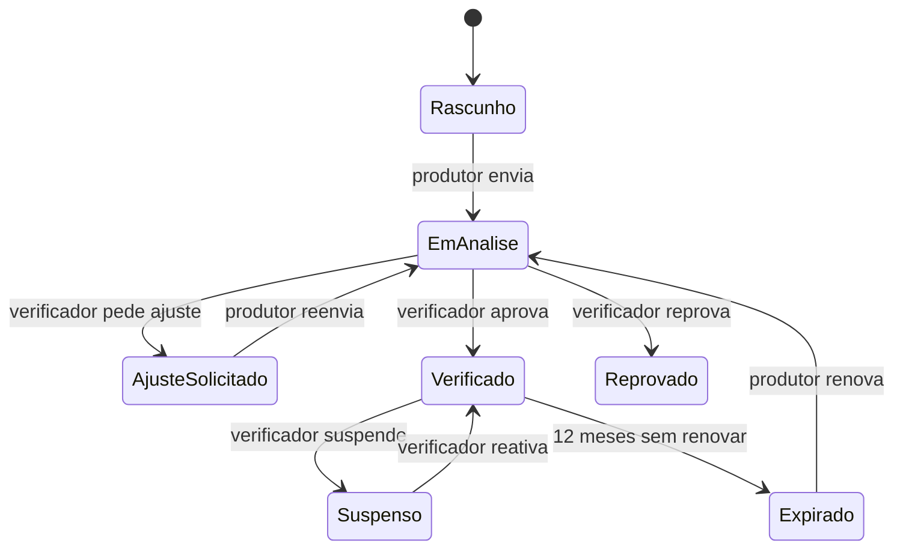

# PRD do MVP · Îasy

26/09/2026 · @Gabriel · versão 2.0, atualizada a partir do protótipo do pitch (mvp/prototipo.html) e de mvp/telas.md

## 1. Visão geral

O MVP da Îasy é uma plataforma web que organiza e confere as informações de negócios da bioeconomia amazônica, transforma esses dados em perfis verificados e conecta esses perfis a investidores e empresas, sem movimentar dinheiro.

| Item | Valor |
| --- | --- |
| Produto | Îasy (marca usada em todas as telas do protótipo; substitui "Amazon Capital", confirmada pelo Gabriel em 26/09/2026) |
| Versão da PRD | 2.0. A 1.0 partia do escopo v1 e do protótipo antigo da Fase 4 (T01 a T18, marca BioRaiz); esta versão segue o protótipo do pitch, com 24 telas (T01 a T24) |
| Responsável de produto e tecnologia | Gabriel Auzier |
| Stack | Next.js (TypeScript) + Supabase (Postgres, Auth, Storage) + Vercel |
| Marco | Pitch Startup One em 28/09/2026 (demo com o protótipo navegável); piloto de 90 dias em seguida |

### 1.1 Problema

Pequenos e médios produtores da bioeconomia amazônica (açaí, cacau nativo, castanha, óleos) têm demanda e capacidade produtiva, mas não conseguem capital porque não têm garantias reais nem dados organizados que comprovem produção e impacto. Investidores de impacto querem esses negócios, mas desistem por falta de dados confiáveis e verificados. O gargalo validado nas entrevistas (5 produtores e 5 investidores) é falta de **informação confiável**, não de dinheiro: "O dinheiro para investir já existe. Faltava confiança entre quem produz e quem investe."

### 1.2 Proposta de valor

> Conectamos quem produz a quem quer investir. Organizamos e conferimos as informações de negócios amazônicos: produtores ganham credibilidade e investidores encontram negócios em que podem confiar.

O produto segue um ciclo de 4 passos, o mesmo da página inicial:

1. **Organizar:** o produtor registra pelo celular a produção, fotos e documentos da terra. Até a foto do caderno vale.
2. **Verificar:** a equipe confere cada informação e concede o selo **Verificado Îasy**, com notas Ambiental, Social e Gestão.
3. **Encontrar:** o investidor responde cinco perguntas e vê primeiro os negócios alinhados ao que busca.
4. **Conectar:** o produtor decide quem acessa seus documentos. Com interesse dos dois lados, a Îasy apresenta um parceiro financeiro para o contrato.

### 1.3 Objetivos do MVP

1. Provar que o produtor consegue gerar, pelo celular, o dado mínimo que o investidor exige.
2. Provar que dado verificado com selo gera interesse real do investidor.
3. Provar que o interesse aceito pelas duas partes e apresentado a um parceiro financeiro vira negociação, **sem a plataforma movimentar dinheiro**.

### 1.4 Princípio que atravessa o produto

A Îasy **só faz a conexão**: não recebe, guarda nem transfere dinheiro. O contrato, o pagamento e o retorno ficam com um parceiro financeiro autorizado, como um banco ou uma fintech. As telas deixam isso claro em três lugares: o rodapé "A Îasy não recebe nem movimenta dinheiro", a frase "Demonstrar interesse ainda não é investir" ao lado do botão "Tenho interesse" e a confirmação obrigatória no formulário de interesse. Isso responde ao principal ponto da validação: os usuários não entendiam se o aporte era investimento ou financiamento.

## 2. Personas e escopo

O MVP atende três perfis que entram pela página inicial (investidor, empresa e produtor) e um papel interno (verificador). Investidor e empresa usam o mesmo fluxo.

### 2.1 Personas

| Persona | Quem é | O que precisa | Exemplo no protótipo |
| --- | --- | --- | --- |
| **Produtora** (gestora de cooperativa, associação ou pequena empresa) | Negócio com CNPJ na Amazônia Legal, precisa de R$ 50 mil a R$ 200 mil, usa celular e WhatsApp, internet intermitente, registros em caderno ou planilha | Mostrar o que produz, ser encontrada e decidir quem vê seus documentos | Raimunda, Cooperativa de Açaí do Mujuú, Cametá (PA), 30 famílias |
| **Investidora** (PF qualificada ou family office) | Quer impacto comprovado com retorno justo; nas entrevistas, não aceita retorno abaixo da Selic | Negócios verificados, alinhados à sua tese, com documentos confiáveis | Helena, investe de R$ 50 a 200 mil |
| **Empresa compradora** | Empresa que compra ingredientes da Amazônia e quer apoiar seus fornecedores | O mesmo que a investidora, com foco nos produtos que compra | Marcos, empresa que compra açaí |
| **Verificador** (equipe Îasy; depois, cooperativas e ONGs credenciadas) | Pessoa que confere fotos, documentos e selos e dá as notas | Uma fila de cadastros com tudo o que o produtor enviou em um lugar | Sem tela no protótipo; citado como "nossa equipe" |

### 2.2 Dentro do escopo

| # | Módulo | Telas |
| --- | --- | --- |
| M1 | Página inicial, entrada sem senha e perfis | T01, T02 (+ código de acesso e termos, a criar) |
| M2 | Cadastro do produtor pelo celular em 5 partes, salvo a cada passo | T15 a T21 |
| M3 | Verificação, selo Verificado Îasy, notas A/S/G e selos de certificadoras | Telas do verificador, a criar |
| M4 | Descoberta em 5 perguntas, resultados com % de alinhamento e vitrine | T03 a T09 |
| M5 | Página do negócio, documentos com liberação da produtora e visualizador controlado | T10 a T12, T23 |
| M6 | "Tenho interesse", aceite da produtora e apresentação ao parceiro financeiro | T13, T14, T24 |
| M7 | Painéis: painel do produtor, meus interesses (investidor), fila e conexões (verificador) | T22 (+ meus interesses e telas do verificador, a criar) |

### 2.3 Fora do escopo

- Movimentar dinheiro: pagamento, custódia, contrato e pagamento do retorno. Exige CVM 88 ou SCD; fica com o parceiro.
- Dashboard de impacto, portfólio, relatório ESG e auditoria do investidor (telas T08 a T13 do protótipo antigo da Fase 4).
- Monitoramento por satélite e integração automática com certificadoras (os selos são conferidos à mão).
- App nativo e modo offline completo (fica o cadastro salvo no aparelho).
- Integração com o site Opinião Amazônia (basta um link para a vitrine).
- Projetos fora da Amazônia Legal, créditos de carbono, tema escuro e cobrança de qualquer tarifa no piloto.
- Barra "Visualizar como Investidor/Produtor" do protótipo: serve só para a demo; no produto o perfil vem da conta.

### 2.4 Decisões adotadas nesta PRD

Decisões tiradas do protótipo (P) ou adotadas como padrão desta PRD (D), que podem ser trocadas sem mudar a estrutura do produto:

1. **Marca Îasy** (P), com selo "Verificado Îasy" e "Nota Îasy".
2. **Entrada só com e-mail e código** (P), sem senha.
3. **Retorno proposto** (P): o produtor informa quanto pode pagar a mais por ano, e a vitrine mostra "Retorno proposto X% ao ano" como ponto de partida. O valor final é definido com o parceiro. Precisa de validação jurídica (seção 8.5).
4. **Interesse somado** (P): "Interesse de investidores: R$ X de R$ Y" soma os interesses pendentes e aceitos. Não é valor captado.
5. **Quem verifica** (D): equipe interna com papel verificador; parceiros credenciados entram depois com o mesmo papel.
6. **Receita** (D): nenhuma cobrança no piloto.
7. **Parceiro financeiro** (D): cadastro configurável (nome, e-mail de contato); a apresentação das partes é por e-mail.
8. **Avisos** (D): investidor recebe e-mail; produtor recebe WhatsApp, que no piloto é enviado pela equipe a partir de modelos prontos, e e-mail quando informar um.

## 3. Histórias de usuário

São 30 histórias, 24 obrigatórias (Must) para o piloto. A coluna "Regras" aponta as regras de negócio da seção 5.

### 3.1 Entrada e acesso (M1)

| ID | História | Regras | Prioridade |
| --- | --- | --- | --- |
| HU-01 | Como **visitante**, quero entender em uma frase o que a Îasy faz e escolher meu caminho (produzir ou investir). | RN-04 | Must |
| HU-02 | Como **visitante**, quero entrar dizendo como uso a Îasy (investir, representar uma empresa ou produzir) e só com meu e-mail, sem senha. | RN-01, RN-02 | Must |
| HU-03 | Como **usuário**, quero autorizar o uso dos meus dados e saber que a Îasy não movimenta dinheiro. | RN-03, RN-04 | Must |

### 3.2 Cadastro do produtor (M2)

| ID | História | Regras | Prioridade |
| --- | --- | --- | --- |
| HU-04 | Como **produtora**, quero saber antes de começar o que ganho e quem vê cada dado. | RN-11, RN-31 | Must |
| HU-05 | Como **produtora**, quero preencher o cadastro em 5 partes curtas pelo celular, para não desistir no meio. | RN-05, RN-06 | Must |
| HU-06 | Como **produtora**, quero que tudo fique salvo a cada passo, mesmo se a internet cair. | RN-07 | Must |
| HU-07 | Como **produtora**, quero tirar fotos da produção, do documento da terra e dos selos pela câmera, e mandar o documento depois se não tiver agora. | RN-08, RN-09 | Must |
| HU-08 | Como **produtora**, quero dizer para que é o dinheiro, quanto, em qual prazo e o retorno que consigo oferecer. | RN-10 | Must |
| HU-09 | Como **produtora**, quero confirmar o envio e saber o que acontece até receber o selo. | RN-12, RN-16 | Must |
| HU-10 | Como **produtora**, quero corrigir só o que a equipe pediu e reenviar. | RN-14 | Must |
| HU-11 | Como **produtora**, quero dizer se vim indicada por uma cooperativa ou ONG. | RN-11 | Should |

### 3.3 Verificação e selo (M3)

| ID | História | Regras | Prioridade |
| --- | --- | --- | --- |
| HU-12 | Como **verificador**, quero uma fila de cadastros enviados, do mais antigo para o mais novo. | RN-16, RN-17 | Must |
| HU-13 | Como **verificador**, quero conferir cada evidência com um checklist e aprovar, pedir ajuste ou reprovar com motivo. | RN-12, RN-18 | Must |
| HU-14 | Como **verificador**, quero dar as notas Ambiental, Social e Gestão e conferir os selos de certificadoras. | RN-19, RN-20 | Must |
| HU-15 | Como **verificador**, quero suspender o selo quando surgir uma irregularidade. | RN-21 | Should |

### 3.4 Descoberta e vitrine (M4)

| ID | História | Regras | Prioridade |
| --- | --- | --- | --- |
| HU-16 | Como **investidora**, quero responder 5 perguntas para ver primeiro os negócios alinhados ao meu perfil. | RN-22, RN-23 | Must |
| HU-17 | Como **investidora**, quero ver a % de alinhamento de cada negócio e o resumo das minhas respostas. | RN-24 | Must |
| HU-18 | Como **investidora**, quero filtrar os resultados por selo de certificadora e por quem recebe visitas. | RN-25 | Should |
| HU-19 | Como **visitante ou investidora**, quero navegar por todos os negócios verificados, com busca e filtros por produto e estado. | RN-26, RN-27 | Must |
| HU-20 | Como **investidora**, quero ver no card o selo, as notas, quanto o negócio busca, o prazo, o retorno proposto e o interesse já demonstrado. | RN-28, RN-29 | Must |
| HU-21 | Como **investidora**, quero alterar minhas respostas depois. | RN-23 | Should |

### 3.5 Página do negócio e documentos (M5)

| ID | História | Regras | Prioridade |
| --- | --- | --- | --- |
| HU-22 | Como **investidora**, quero ver a produção, o negócio, quem cuida, o dinheiro e os documentos em abas. | RN-30, RN-31 | Must |
| HU-23 | Como **investidora**, quero pedir acesso a documentos sensíveis e ver a situação de cada um. | RN-32 | Must |
| HU-24 | Como **produtora**, quero liberar ou recusar cada pedido de documento e retirar o acesso quando quiser. | RN-32, RN-33 | Must |
| HU-25 | Como **investidora com acesso**, quero ler o documento na tela, sabendo que não posso baixar e que meu nome aparece nele. | RN-34, RN-35 | Must |

### 3.6 Interesse e conexão (M6 e M7)

| ID | História | Regras | Prioridade |
| --- | --- | --- | --- |
| HU-26 | Como **investidora**, quero dizer "Tenho interesse" com o valor e uma mensagem, deixando claro que ainda não é investimento. | RN-36 a RN-38 | Must |
| HU-27 | Como **investidora**, quero acompanhar cada etapa do meu interesse até o contrato com o parceiro. | RN-40 | Must |
| HU-28 | Como **produtora**, quero ver quem tem interesse e quanto, e aceitar ou recusar seguir com cada um. | RN-39 | Must |
| HU-29 | Como **produtora**, quero um painel com meu selo, minhas notas, as visitas ao perfil, os pedidos e os interesses. | RN-35, RN-41 | Must |
| HU-30 | Como **verificador**, quero ver os interesses aceitos e apresentar as partes ao parceiro financeiro. | RN-40 | Should |

## 4. Requisitos funcionais

| ID | Requisito | Histórias |
| --- | --- | --- |
| **M1 · Entrada e acesso** |  |  |
| RF-01 | Página inicial (T01) com a frase principal, card de exemplo, os 4 passos, dois botões de caminho ("Sou produtor, quero ser encontrado" e "Sou investidor, quero conhecer negócios") e menu "Como funciona · Negócios verificados · Para produtores · Entrar". | HU-01 |
| RF-02 | Tela Entrar (T02) com três perfis ("Quero investir", "Represento uma empresa", "Produzo na Amazônia") e campo de e-mail; envio de código de acesso por e-mail e tela para digitá-lo (a criar), via Supabase Auth OTP. | HU-02 |
| RF-03 | Redirecionamento por perfil: investidor e empresa para a descoberta (ou para a vitrine se já responderam), produtor para as boas-vindas (T15) ou para o painel (T22) se já enviou, verificador para a fila. | HU-02 |
| RF-04 | Aceite dos termos e da política de privacidade no primeiro acesso do investidor, e autorização de uso dos dados na parte 1 do produtor (T16). | HU-03 |
| **M2 · Cadastro do produtor** |  |  |
| RF-05 | Boas-vindas (T15): o que ganha, "Quem vê o quê" e "Chegou até nós por uma cooperativa ou ONG?" com a lista de parceiros. | HU-04, HU-11 |
| RF-06 | Parte 1, Sobre você (T16): nome, telefone com WhatsApp, e-mail opcional, CNPJ e autorização de uso dos dados. | HU-05 |
| RF-07 | Parte 2, Seu negócio (T17): nome, tipo (Cooperativa, Associação, Pequena empresa), cidade e estado, número de famílias, tempo de atividade e se recebe visitas de investidores. | HU-05 |
| RF-08 | Parte 3, Sua produção (T18): produtos (Açaí, Cacau, Castanha, Cupuaçu, Andiroba, Copaíba, Outro), produção mensal aproximada, práticas de cuidado com a floresta e impactos gerados (as mesmas 7 opções da pergunta 5 da descoberta). | HU-05 |
| RF-09 | Parte 4, Fotos e documentos (T19): fotos de onde produzem e do produto, documento da terra (CAR ou DAP, pode ir depois) e selos que já têm (opcional), pela câmera ou por arquivo. | HU-07 |
| RF-10 | Parte 5, Quanto vocês precisam (T20): finalidade, valor, prazo para devolver, retorno ao ano e a explicação "O que é o retorno?". Botão "Enviar para análise". | HU-08 |
| RF-11 | Indicador "Parte N de 5 · Salvo" em todas as partes, com rascunho no aparelho sincronizado com o servidor. | HU-06 |
| RF-12 | Cadastro enviado (T21): prazo de até 5 dias úteis e os 3 passos seguintes; botão "Ir para o meu painel". | HU-09 |
| RF-13 | Correção de ajuste: o produtor vê o que a equipe pediu e edita só esses campos antes de reenviar (tela PRO-07, a criar). | HU-10 |
| **M3 · Verificação** |  |  |
| RF-14 | Fila de verificação com data de entrada, dias úteis decorridos e responsável. | HU-12 |
| RF-15 | Tela de análise com dados e evidências lado a lado, checklist, conferência de cada selo de certificadora, notas A/S/G, motivo e ações Aprovar, Pedir ajuste e Reprovar. | HU-13, HU-14 |
| RF-16 | Suspensão e reativação do selo com motivo, e histórico de todas as decisões. | HU-15 |
| **M4 · Descoberta e vitrine** |  |  |
| RF-17 | Descoberta em 5 perguntas (T03 a T07), com "Pergunta N de 5", botões Voltar e Continuar, "Pular esta pergunta" na 5ª e "Ver negócios alinhados" no fim. | HU-16 |
| RF-18 | Resultados (T08): negócios ordenados por alinhamento, % no card, chips com o resumo das respostas, "Alterar respostas" e filtros Todos, Com selo de certificadora e Recebe visitas. | HU-17, HU-18, HU-21 |
| RF-19 | Vitrine "Negócios verificados" (T09): busca por nome ou cidade, filtros de produto e estado, contador de negócios e estado vazio. | HU-19 |
| RF-20 | Card de negócio com foto, selo Verificado Îasy, selos de certificadoras, nome, produto e cidade, "Busca", "Prazo", "Retorno proposto", Nota Îasy (A/S/G) e barra "Interesse de investidores". | HU-20 |
| **M5 · Página do negócio e documentos** |  |  |
| RF-21 | Página do negócio (T10): cabeçalho (foto, data de verificação, nome, produto, cidade, famílias, selos, busca, prazo, retorno proposto, notas), abas A produção, O negócio, Quem cuida, O dinheiro e Documentos, lateral com interesse somado, botão "Tenho interesse" e etiqueta "Recebe visitas de investidores". | HU-22 |
| RF-22 | Aba Documentos (T11): tabela com documento, tipo, data, situação e ação; caixa "Quem decide é a produtora". | HU-23 |
| RF-23 | Pedidos de documento da produtora (T23): Liberar ou Recusar cada pedido, lista de já respondidos e opção de retirar um acesso liberado. | HU-24 |
| RF-24 | Visualizador controlado (T12): só leitura, marca d'água com nome e data, sem download nem cópia, registro de cada acesso. | HU-25 |
| RF-25 | Envio de documentos adicionais pela produtora (laudo ambiental, certificado completo) no painel. | HU-23 |
| **M6 e M7 · Interesse, conexão e painéis** |  |  |
| RF-26 | Formulário "Tenho interesse" (T13) com valor, mensagem opcional à produtora e confirmação obrigatória. | HU-26 |
| RF-27 | Interesse enviado (T14): linha do tempo com 4 etapas e resumo do que foi enviado; "Meus interesses" lista todos (a criar). | HU-27 |
| RF-28 | Quem tem interesse (T24): cada interesse com perfil, data, situação, valor e mensagem; ações "Aceitar e seguir" e "Recusar". | HU-28 |
| RF-29 | Painel do produtor (T22): selo e data, notas, link "Ver meu perfil como o investidor vê", visitas ao perfil, pedidos aguardando resposta, investidores interessados e barra inferior Início, Pedidos, Interesses. | HU-29 |
| RF-30 | Painel de conexões do verificador com "Apresentar ao parceiro" e atualização de etapa. | HU-30 |
| **Transversal** |  |  |
| RF-31 | Avisos: cadastro recebido, ajuste pedido, selo concedido, reprovação, pedido de documento, documento liberado, interesse recebido, interesse aceito e apresentação ao parceiro. | várias |
| RF-32 | Registro de eventos de produto para as métricas da seção 8. | todas |

## 5. Regras de negócio e critérios de aceite

São 41 regras, cada uma com critérios de aceite no formato Dado / Quando / Então. A origem indica de onde a regra saiu: entrevistas (E), validação da solução (V), escopo (S), protótipo (P) ou decisão padrão desta PRD (D).

### 5.1 Entrada e acesso

**RN-01 · Perfil por conta** (P, S) Toda conta tem um perfil: investidor, empresa ou produtor, escolhido em "Como você usa a Îasy?". Investidor e empresa têm as mesmas permissões; o tipo aparece para a produtora ("Investidora", "Empresa que compra açaí"). O papel verificador só é criado pela equipe Îasy.

- **CA-01.1** Dada a tela Entrar sem perfil marcado, quando o visitante toca em "Entrar", então o botão está desabilitado.
- **CA-01.2** Dado um produtor logado, quando ele acessa uma rota de investidor ou de verificador, então recebe "Sem permissão" e a API não retorna dados dessas áreas.
- **CA-01.3** Dada uma requisição pública de cadastro com papel verificador, quando enviada, então o servidor responde 403.

**RN-02 · Entrada sem senha** (P) O acesso é só por e-mail: a Îasy envia um código de 6 dígitos, válido por 10 minutos, com até 5 tentativas. A sessão dura 30 dias no aparelho. Toda área privada exige sessão.

- **CA-02.1** Dado um código vencido ou errado 5 vezes, quando o usuário tenta de novo, então precisa pedir um novo código.
- **CA-02.2** Dado um e-mail que ainda não tem conta, quando o código é confirmado, então a conta é criada com o perfil escolhido.
- **CA-02.3** Dado um visitante sem sessão, quando ele acessa uma URL privada, então é levado à tela Entrar e volta à URL original depois do código.

**RN-03 · Consentimento e LGPD** (P, D) O produtor só avança da parte 1 com a autorização marcada ("Autorizo a Îasy a usar estes dados para montar meu perfil e apresentá-lo a investidores. Posso pedir a exclusão quando quiser."). O investidor aceita os Termos de Uso e a Política de Privacidade no primeiro acesso. A plataforma guarda a versão e a data de cada aceite.

- **CA-03.1** Dada a parte 1 sem a autorização marcada, quando o produtor toca em "Continuar", então a parte não avança.
- **CA-03.2** Dado um aceite, quando se consulta a conta no banco, então existem a versão do texto e o carimbo de data e hora.
- **CA-03.3** Dado um pedido de exclusão, quando atendido, então os dados pessoais são apagados em até 15 dias e o negócio sai da vitrine.

**RN-04 · A plataforma só faz a conexão** (V, S, P) A Îasy não recebe, guarda nem transfere dinheiro. O rodapé "A Îasy não recebe nem movimenta dinheiro. O contrato e o pagamento são feitos por um parceiro financeiro autorizado." aparece na página inicial, nos resultados, na vitrine, na página do negócio, no formulário de interesse, na tela de interesse enviado, na parte 5 do cadastro e em "Quem tem interesse". Textos proibidos na interface: "investir agora", "rendimento", "retorno garantido", "captado" e "captação". "Retorno" só aparece como "Retorno proposto" ou no contexto do parceiro financeiro.

- **CA-04.1** Dadas as 8 telas acima, quando exibidas, então o rodapé aparece com o texto exato.
- **CA-04.2** Dado o código da interface, quando se buscam os textos proibidos, então nenhuma ocorrência visível é encontrada.
- **CA-04.3** Dado qualquer fluxo, quando executado de ponta a ponta, então nenhuma tela pede dados bancários, cartão ou Pix.

### 5.2 Cadastro do produtor

**RN-05 · Elegibilidade** (S, E) Só envia cadastro quem tem CNPJ válido e cidade na Amazônia Legal (lista do IBGE). Cada CNPJ tem no máximo um negócio não encerrado.

- **CA-05.1** Dado um CNPJ com dígito verificador inválido, quando o produtor sai do campo, então aparece "CNPJ inválido" e a parte não avança.
- **CA-05.2** Dada uma cidade fora da Amazônia Legal, quando o produtor tenta avançar a parte 2, então o sistema explica que o piloto atende só a Amazônia Legal e oferece deixar o contato.
- **CA-05.3** Dado um CNPJ que já tem negócio em rascunho, em análise ou verificado, quando outra conta tenta cadastrá-lo, então o envio é bloqueado.

**RN-06 · Partes e campos obrigatórios** (P) O cadastro tem 5 partes. Obrigatórios: parte 1, nome, telefone, CNPJ e autorização; parte 2, todos; parte 3, ao menos 1 produto, a produção mensal e ao menos 1 prática; parte 4, ver RN-08; parte 5, finalidade, valor, prazo e retorno. Voltar nunca apaga o que foi preenchido. As práticas começam desmarcadas ("Marque apenas o que praticam").

- **CA-06.1** Dada uma parte com obrigatório vazio, quando o produtor toca em "Continuar", então o primeiro campo inválido recebe foco com a mensagem de erro.
- **CA-06.2** Dada a parte 4 preenchida, quando o produtor volta à parte 2 e retorna, então dados e fotos continuam lá.
- **CA-06.3** Dada a produção mensal zero, negativa ou não numérica, quando o produtor tenta avançar, então o campo é rejeitado.

**RN-07 · Salvo a cada passo** (P, E) Cada alteração é salva no aparelho na hora e sincronizada quando há conexão. O cabeçalho mostra "Parte N de 5 · Salvo"; sem internet, mostra "Salvo no celular". O rascunho no servidor dura 90 dias sem atividade.

- **CA-07.1** Dado o produtor sem internet na parte 3, quando ele fecha e reabre o navegador, então os dados continuam preenchidos e o indicador mostra "Salvo no celular".
- **CA-07.2** Dado um rascunho só no aparelho, quando a conexão volta, então ele é enviado sem ação do usuário e o indicador volta a "Salvo".
- **CA-07.3** Dado um rascunho parado há 90 dias, quando a rotina diária roda, então ele é apagado, com aviso 7 dias antes.

**RN-08 · Fotos e documentos** (P, E) Para enviar é preciso ao menos 1 foto de onde produzem e 1 do produto ou da colheita. Fotos do caderno ou da planilha valem. O documento da terra (CAR ou DAP) pode ser enviado depois, mas o selo só é concedido com ele. Selos de certificadoras são opcionais. Formatos JPG, PNG, HEIC e PDF, até 10 MB por arquivo e 10 arquivos por grupo.

- **CA-08.1** Dado um grupo de fotos obrigatório vazio, quando o produtor toca em "Continuar", então o grupo é destacado e a parte não avança.
- **CA-08.2** Dado um cadastro enviado sem documento da terra, quando o verificador tenta aprovar, então a ação fica bloqueada e ele só pode pedir ajuste.
- **CA-08.3** Dado um arquivo de 12 MB ou em .docx, quando anexado, então é recusado com a mensagem do limite ou do formato.

**RN-09 · Envio leve de fotos** (E, P) Fotos são comprimidas no aparelho (lado maior até 1.600 px) e enviadas em fila, com retomada se a conexão cair. Cada grupo mostra "Enviado · N fotos" e permite "Trocar".

- **CA-09.1** Dada uma foto de 4.000 px, quando anexada, então o arquivo no Storage tem lado maior de até 1.600 px.
- **CA-09.2** Dado um envio interrompido, quando a conexão volta, então ele recomeça sozinho sem duplicar a foto.

**RN-10 · Quanto vocês precisam** (P) A finalidade é uma entre Obras e estrutura, Equipamentos, Aumentar a área e Contas do dia a dia. O valor vai de R$ 50 mil a R$ 200 mil, em passos de R$ 5 mil. O prazo para devolver é 12, 18, 24 ou 36 meses. O retorno ao ano vai de 0% a 30%, com uma casa decimal, e é apresentado como proposta: "Ele serve de ponto de partida: o valor final é definido com o parceiro financeiro."

- **CA-10.1** Dado um valor fora de R$ 50 mil a R$ 200 mil, quando o produtor tenta enviar, então o campo mostra os limites.
- **CA-10.2** Dado o retorno "14,8", quando salvo, então aparece na vitrine como "Retorno proposto 14,8% ao ano".
- **CA-10.3** Dada a parte 5, quando exibida, então a caixa "O que é o retorno?" e o rodapé de RN-04 estão visíveis.

**RN-11 · Indicação por parceiro** (P) As boas-vindas perguntam se o produtor chegou por uma cooperativa ou ONG. Se sim, ele escolhe o parceiro numa lista mantida pela equipe. A indicação fica registrada no negócio e aparece para o verificador, sem ser exibida ao investidor.

- **CA-11.1** Dado "Sim" marcado sem parceiro escolhido, quando o produtor toca em "Começar cadastro", então o campo "Qual?" é destacado.
- **CA-11.2** Dado um negócio indicado, quando o verificador abre a análise, então vê o nome do parceiro que indicou.

### 5.3 Ciclo do negócio e verificação

**RN-12 · Estados do negócio** (S, D) O negócio segue a máquina de estados abaixo; nenhuma outra transição é permitida.

- **CA-12.1** Dado um negócio em Rascunho, quando alguém tenta mudá-lo para Verificado pela API, então a operação é rejeitada.
- **CA-12.2** Dado um negócio Em análise, quando o produtor abre o cadastro, então os campos ficam somente leitura.
- **CA-12.3** Dado um negócio Reprovado, quando o produtor abre o painel, então vê o motivo e a data a partir da qual pode recomeçar (30 dias depois).

**RN-13 · Vitrine só com negócios verificados** (S, P) Só negócios Verificados aparecem na vitrine, nos resultados e na busca ("Todos passaram pela conferência da nossa equipe"). Os demais só são vistos pelo dono e pelos verificadores.

- **CA-13.1** Dado um negócio Em análise, quando um investidor busca pelo nome exato, então ele não aparece.
- **CA-13.2** Dada a URL de um negócio Suspenso, quando acessada, então aparece "Negócio indisponível no momento".

**RN-14 · Ajuste solicitado** (P, D) O verificador marca os itens com problema e escreve o motivo. O produtor recebe o aviso pelo WhatsApp ("Se faltar algo, avisamos pelo WhatsApp"), edita só os itens marcados e reenvia; o reenvio volta ao fim da fila.

- **CA-14.1** Dado um negócio em Ajuste solicitado, quando o produtor abre o cadastro, então só os campos marcados estão editáveis, cada um com o comentário do verificador.
- **CA-14.2** Dado o reenvio, quando salvo, então o negócio volta a Em análise com a data do reenvio.

**RN-15 · Edição após publicação** (D) Campos críticos (CNPJ, cidade, produtos, produção, valor, prazo, retorno e documento da terra) geram uma nova versão que passa por análise; enquanto isso, a vitrine mostra a última versão verificada. Fotos adicionais e telefone são publicados na hora.

- **CA-15.1** Dado um negócio Verificado, quando o produtor altera o valor, então a vitrine continua com o valor anterior e a nova versão entra na fila.

**RN-16 · Prazo de verificação** (P, S) A resposta sai em até 5 dias úteis da entrada na fila, como promete a tela "Cadastro enviado". Na fila, itens com mais de 3 dias úteis ficam em amarelo e com mais de 5, em vermelho.

- **CA-16.1** Dado um negócio há 4 dias úteis na fila, quando o verificador abre a fila, então o item está em amarelo.
- **CA-16.2** Dado um negócio decidido, quando se consulta o registro, então existe o tempo em dias úteis.

**RN-17 · Ordem e atribuição da fila** (D) A fila é ordenada do mais antigo para o mais novo. Ao abrir um item, ele fica com o verificador por 24 horas.

- **CA-17.1** Dado um negócio atribuído ao verificador A, quando o verificador B tenta decidir, então a ação é bloqueada com o nome de quem está analisando.

**RN-18 · Decisão de verificação** (V, S) Aprovar exige todos os itens do checklist conferidos: CNPJ ativo e compatível com o nome, documento da terra legível e compatível com a cidade, fotos compatíveis com os produtos, produção mensal coerente e práticas declaradas plausíveis. Pedir ajuste ou reprovar exige motivo com ao menos 20 caracteres. Toda decisão fica registrada com autor, data e motivo, sem edição.

- **CA-18.1** Dado um item do checklist não conferido, quando o verificador tenta aprovar, então "Aprovar" fica desabilitado.
- **CA-18.2** Dada qualquer decisão, quando se abre o histórico, então ela aparece com autor, data, hora e motivo.

**RN-19 · Selo e Nota Îasy** (P, V) Ao aprovar, o verificador dá notas inteiras de 0 a 100 para Ambiental, Social e Gestão. As três aparecem separadas ("Nota Îasy, de 0 a 100: Ambiental 94, Social 91, Gestão 86"), sem média na tela. O negócio recebe o selo "Verificado Îasy", com a data da verificação ("Verificado Îasy em 12/09/2026"), válido por 12 meses.

- **CA-19.1** Dada uma nota decimal ou fora de 0 a 100, quando salva, então é rejeitada.
- **CA-19.2** Dado um selo concedido em 01/10/2026 sem renovação, quando chega 01/10/2027, então o negócio passa para Expirado e sai da vitrine; o produtor é avisado 30 dias antes.

**RN-20 · Selos de certificadoras** (P) Selos enviados pelo produtor (Orgânico Brasil, Fair Trade, Rainforest Alliance e outros) só aparecem depois de conferidos pelo verificador, com a legenda "certificado conferido pela Îasy". Selo não conferido não aparece.

- **CA-20.1** Dado um selo enviado e ainda não conferido, quando o negócio é exibido, então o selo não aparece no card nem na página.
- **CA-20.2** Dado um selo conferido, quando o card é exibido, então aparece a sigla (OB, FT, RA) com a legenda no passar do mouse.

**RN-21 · Suspensão do selo** (D) O verificador pode suspender um negócio Verificado com motivo. A suspensão tira o negócio da vitrine, bloqueia novos interesses e pedidos de documento e avisa o produtor e quem tem interesse em aberto.

- **CA-21.1** Dado um negócio suspenso, quando um investidor tenta enviar interesse por um link antigo, então a ação é bloqueada.

### 5.4 Descoberta e vitrine

**RN-22 · As cinco perguntas** (P) 1) O que pesa mais: Impacto primeiro, Retorno primeiro, As pessoas primeiro ou Equilíbrio (escolha única). 2) Perfil (Pessoa física qualificada, Pela minha família, Empresa que compra da Amazônia) e valor (Até R$ 50 mil, R$ 50 a 200 mil, Acima de R$ 200 mil). 3) Produtos: Alimentos, Cosméticos, Óleos vegetais, Castanha, Cacau ou Todos (ao menos 1). 4) Prazo: Até 18, 24 ou 36 meses (escolha única). 5) Impacto: Floresta em pé, Renda para as famílias, Mulheres na liderança, Comunidades tradicionais, Colheita que preserva a mata, Saber de onde vem o produto e Jovens no campo (várias, opcional).

- **CA-22.1** Dada a pergunta 3 sem produto marcado, quando o investidor toca em "Continuar", então o botão está desabilitado.
- **CA-22.2** Dada a pergunta 3, quando o investidor marca "Todos", então os demais são desmarcados.
- **CA-22.3** Dada a pergunta 5, quando o investidor toca em "Pular esta pergunta", então os resultados aparecem sem o critério de impacto.
- **CA-22.4** Dada qualquer pergunta, quando o investidor volta, então a resposta anterior continua marcada e o cabeçalho mostra "Pergunta N de 5".

**RN-23 · Respostas salvas** (P, D) Visitantes respondem sem conta; as respostas ficam no navegador e passam para o perfil ao entrar. "Alterar respostas" reabre as perguntas com as respostas atuais; salvar substitui as anteriores.

- **CA-23.1** Dado um visitante que respondeu tudo, quando ele entra, então as respostas aparecem salvas sem repetir.
- **CA-23.2** Dado um investidor nos resultados, quando toca em "Alterar respostas", então volta à pergunta 1 com as respostas marcadas.

**RN-24 · Cálculo do alinhamento** (P, D) O alinhamento vai de 0 a 100% e considera produto, valor, prazo e impacto, como explica a tela de resultados, mais a prioridade da pergunta 1:

| Critério | Peso | Como pontua |
| --- | --- | --- |
| Produto | 30 | 30 se algum produto do negócio está numa categoria escolhida (ou "Todos"). Açaí e Cupuaçu contam como Alimentos; Cacau como Cacau e Alimentos; Castanha como Castanha e Alimentos; Andiroba e Copaíba como Óleos vegetais e Cosméticos |
| Valor | 25 | 25 se o valor que o negócio busca está na faixa escolhida; 10 se está na faixa vizinha; 0 nos demais casos |
| Prazo | 20 | 20 se o prazo do negócio é menor ou igual ao aceito; 8 se passa em até 12 meses; 0 nos demais casos |
| Impacto | 15 | 15 × (impactos em comum ÷ impactos escolhidos); pergunta pulada vale 8 para todos |
| Prioridade | 10 | 10 × nota ÷ 100, usando Ambiental (Impacto primeiro), Social (As pessoas primeiro), Gestão (Retorno primeiro) ou a média das três (Equilíbrio) |

O resultado é arredondado para inteiro. Os resultados são ordenados pelo alinhamento, com empate decidido pela média das notas e depois pela verificação mais recente, e mostram negócios com 40% ou mais.

- **CA-24.1** Dado um negócio de açaí que busca R$ 180 mil em 24 meses, com impactos Floresta em pé e Renda para as famílias e Ambiental 90, e uma investidora com Alimentos, R$ 50 a 200 mil, até 24 meses, 3 impactos (os dois do negócio e Mulheres na liderança) e Impacto primeiro, quando o alinhamento é calculado, então o resultado é 30 + 25 + 20 + 10 + 9 = **94%**.
- **CA-24.2** Dado um negócio com 35%, quando os resultados são exibidos, então ele não aparece nos resultados, mas continua na vitrine.
- **CA-24.3** Dados os mesmos dados, quando o cálculo roda duas vezes, então o resultado é idêntico (função pura com testes unitários).

**RN-25 · Filtros dos resultados** (P) Os resultados têm os filtros Todos, Com selo de certificadora (ao menos um selo conferido) e Recebe visitas (o produtor marcou que recebe visitas de investidores).

- **CA-25.1** Dado o filtro "Com selo de certificadora", quando aplicado, então somem os negócios sem selo conferido.

**RN-26 · Vitrine pública** (S, V) A página inicial, a vitrine, os resultados e a aba "A produção" são públicos, para o link do site parceiro funcionar sem login. As demais abas e o "Tenho interesse" exigem entrar como investidor ou empresa.

- **CA-26.1** Dado um visitante na página do negócio, quando toca em "O dinheiro", então é convidado a entrar.

**RN-27 · Busca e filtros da vitrine** (P) A vitrine busca por nome do negócio ou cidade sem diferenciar maiúsculas e acentos, e filtra por produto e estado. Filtros se combinam e ficam na URL. O contador mostra "N negócios".

- **CA-27.1** Dado "Castanha Solidária Xingu", quando o investidor busca "solidaria", então o negócio aparece.
- **CA-27.2** Dada uma busca sem resultado, quando exibida, então aparece "Nenhum negócio encontrado" e "Limpar filtros".

**RN-28 · Conteúdo do card** (P) O card mostra foto, selo Verificado Îasy, siglas dos selos conferidos, nome, produto e cidade/UF, "Busca R$ X", "Prazo N meses", "Retorno proposto X% ao ano", Nota Îasy (Ambiental, Social, Gestão) e a barra de interesse; nos resultados, também "N% alinhado ao seu perfil". O card inteiro leva à página do negócio.

- **CA-28.1** Dado um negócio verificado, quando o card é exibido, então selo, notas, busca, prazo e retorno proposto estão visíveis.
- **CA-28.2** Dado qualquer card, quando renderizado, então nenhum texto proibido de RN-04 aparece.

**RN-29 · Interesse somado** (P) "Interesse de investidores: R$ X de R$ Y" soma os valores dos interesses Pendentes e Aceitos do negócio. A barra para em 100% mesmo se a soma passar do valor buscado. O texto sempre diz "interesse", nunca "captado".

- **CA-29.1** Dado um interesse aceito de R$ 15 mil e um pendente de R$ 80 mil num negócio que busca R$ 180 mil, quando o card é exibido, então aparece "R$ 95 mil de R$ 180 mil".
- **CA-29.2** Dado um interesse recusado ou cancelado, quando o card é recalculado, então ele sai da soma.

### 5.5 Página do negócio e documentos

**RN-30 · Abas e visibilidade** (P, V) As abas são A produção (pública), O negócio, Quem cuida, O dinheiro e Documentos (investidor ou empresa logados). "A produção" mostra o que produz, quanto produz por mês, como cuidam da floresta (só as práticas marcadas) e fotos. "O dinheiro" mostra finalidade, valor, prazo, retorno proposto e a explicação do retorno.

- **CA-30.1** Dado um produtor que marcou só "Colhemos sem derrubar a mata", quando a aba A produção é exibida, então só essa prática aparece.
- **CA-30.2** Dada uma requisição direta à API das abas restritas sem sessão de investidor, quando executada, então retorna 401 ou 403 (RLS no Supabase).

**RN-31 · Quem vê o quê** (P, V) Quem investe vê nome do negócio, cidade, o que produz, fotos e quanto precisa. Documentos da terra (CAR, DAP), laudos e certificados completos só com autorização da produtora. Ninguém vê telefone, e-mail ou CPF do produtor; o contato só é trocado depois do aceite (RN-39).

- **CA-31.1** Dada a aba Quem cuida, quando exibida, então mostra nome e função das pessoas, sem telefone ou e-mail.
- **CA-31.2** Dado um interesse pendente, quando o investidor vê seus interesses, então o contato da produtora não aparece.

**RN-32 · Situações dos documentos** (P) Cada documento tem uma situação para cada investidor: Aberto a todos (resumo do negócio, gerado pela Îasy), Precisa de liberação (botão "Solicitar acesso"), Pedido enviado ("Aguardando a produtora"), Liberado para você ("Ver documento") e Não liberado ("A produtora optou por não liberar"). A produtora libera ou recusa cada pedido; sem resposta em 7 dias, o pedido expira e pode ser refeito.

- **CA-32.1** Dado um pedido enviado, quando o investidor volta à aba, então a situação é "Pedido enviado" e o botão some.
- **CA-32.2** Dado um novo pedido, quando criado, então ele aparece em "Pedidos de documento" e no contador do painel da produtora.
- **CA-32.3** Dado um pedido recusado, quando o investidor vê a aba, então aparece "A produtora optou por não liberar", sem motivo.

**RN-33 · Validade e retirada do acesso** (P, D) O acesso liberado vale 30 dias e a produtora pode retirá-lo a qualquer momento, com efeito imediato ("A produtora pode retirar o acesso a qualquer momento").

- **CA-33.1** Dado um acesso liberado em 01/10, quando chega 31/10, então o investidor vê "Acesso expirado, solicite novamente".
- **CA-33.2** Dado um documento aberto, quando a produtora retira o acesso, então a próxima página é negada.

**RN-34 · Visualização controlada** (P, V) Documentos sensíveis abrem só na tela, sem download, impressão ou cópia de texto, com marca d'água "Visualizado por [nome] em [data]" e o aviso "Somente visualização · acesso registrado". O painel mostra quem liberou e quando. Os arquivos ficam em bucket privado, servidos por URL assinada de até 5 minutos. Captura de tela não pode ser impedida; a marca d'água serve para rastrear vazamentos.

- **CA-34.1** Dado um investidor com acesso, quando abre o documento, então não há opção de baixar e a marca d'água mostra seu nome e a data.
- **CA-34.2** Dada uma URL assinada usada 6 minutos depois, quando acessada, então o Storage nega.

**RN-35 · Registro de acessos e visitas** (P) Cada abertura de documento registra investidor, documento, data e hora, visíveis para a produtora. Cada visita à página do negócio conta uma vez por pessoa por dia no indicador "visitas ao seu perfil".

- **CA-35.1** Dado um investidor que abriu a página 3 vezes no mesmo dia, quando o painel é exibido, então conta 1 visita.

### 5.6 Interesse e conexão

**RN-36 · Quem pode demonstrar interesse** (S, P) Só investidor ou empresa logados, em negócio Verificado. O valor vai de R$ 1.000 até o valor que o negócio busca; a mensagem para a produtora é opcional, com até 500 caracteres. O formulário lembra quanto o negócio busca e quanto já foi demonstrado por outros.

- **CA-36.1** Dado um visitante, quando toca em "Tenho interesse", então vai à tela Entrar e volta ao formulário depois.
- **CA-36.2** Dado um negócio que busca R$ 180 mil, quando o investidor informa R$ 200 mil, então o campo mostra "O valor não pode passar do que o negócio busca".
- **CA-36.3** Dado um produtor logado, quando abre um negócio, então o botão "Tenho interesse" não aparece.

**RN-37 · Um interesse ativo por negócio** (D) Cada investidor tem no máximo um interesse Pendente ou Aceito por negócio. Enquanto Pendente, pode editar o valor ou cancelar.

- **CA-37.1** Dado um interesse pendente, quando o investidor abre o negócio, então o botão vira "Ver meu interesse".

**RN-38 · Interesse não é investimento** (P, V) O envio exige marcar "Entendo que estou demonstrando interesse, e não investindo agora. O contrato é firmado depois, com um parceiro financeiro." A frase "Demonstrar interesse ainda não é investir" fica ao lado do botão na página do negócio.

- **CA-38.1** Dada a confirmação desmarcada, quando o investidor toca em "Enviar interesse", então o botão está desabilitado.
- **CA-38.2** Dado um interesse enviado, quando se consulta o banco, então o registro guarda o texto aceito e o horário.

**RN-39 · Resposta da produtora** (P, S) A produtora vê cada interesse com nome, tipo, data, situação (Novo, Aceito, Recusado), valor e mensagem, e escolhe "Aceitar e seguir" ou "Recusar". Ao aceitar, as partes recebem o contato uma da outra e são apresentadas ao parceiro financeiro. Sem resposta em 10 dias, o interesse expira.

- **CA-39.1** Dado um interesse Novo, quando a produtora toca em "Aceitar e seguir", então a situação vira Aceito com a etapa "Apresentação ao parceiro financeiro" e o investidor é avisado.
- **CA-39.2** Dado um interesse recusado, quando o investidor vê seus interesses, então aparece "Não aceito pela produtora" e nenhum contato é revelado.

**RN-40 · Etapas da conexão** (P, S) O investidor acompanha 4 etapas: Interesse enviado, A produtora responde, Apresentamos as partes e Contrato com o parceiro financeiro. Por dentro, a conexão passa por Pendente, Aceita, Apresentada ao parceiro, Em negociação e termina em Concluída ou Não avançou. A partir de Apresentada, só o verificador muda a etapa, com observação. O aceite e o envio incluem o consentimento para compartilhar nome, contato e dados do negócio com o parceiro. A plataforma não registra valor efetivamente contratado.

- **CA-40.1** Dado um interesse Pendente, quando o verificador tenta apresentá-lo ao parceiro, então a ação não está disponível.
- **CA-40.2** Dado um interesse Aceito, quando o verificador apresenta as partes, então o parceiro recebe o e-mail com os dados das duas partes e a etapa muda para Apresentamos as partes.

**RN-41 · Avisos** (P, D) O investidor recebe e-mail a cada novidade ("Avisamos você a cada novidade"). O produtor recebe WhatsApp para ajuste pedido, selo concedido, pedido de documento e interesse recebido; no piloto, a equipe envia a partir de modelos prontos, e o e-mail vai junto quando o produtor informou um.

- **CA-41.1** Dado um interesse recebido, quando registrado, então o aviso ao produtor entra na lista de envios do dia da equipe e o painel mostra o contador atualizado.

## 6. Handoff de design

O protótipo do pitch tem 24 telas estáticas: 14 do investidor em desktop (1440 px), 2 comuns e 11 do produtor em celular (390 px). Só a navegação por links funciona; campos, filtros e abas são visuais. A lista do que ainda falta desenhar está no relatório de gaps.

### 6.1 Diretrizes globais

1. **Marca Îasy**: logo em círculo verde com recorte em crescente, "Îasy" em serifa. Selo "Verificado Îasy" e "Nota Îasy".
2. **Tema claro** como único tema.
3. **Rodapé de conexão** (RN-04) nas 8 telas indicadas.
4. **Linguagem simples**: "negócio" em vez de projeto, "Busca R$ X" em vez de meta, "Tenho interesse" em vez de investir, "Retorno proposto" sempre com a explicação.
5. **Navegação por perfil**: visitante com "Como funciona · Negócios verificados · Para produtores · Entrar"; investidor com "Descobrir · Negócios · Meus interesses" e avatar; produtor com barra inferior "Início · Pedidos · Interesses".
6. **Produtor mobile-first** (360 a 390 px); investidor desktop-first, responsivo até 360 px.
7. A barra "Visualizar como" existe só na demo e sai do produto.

### 6.2 Inventário de telas

| Tela | Código | Perfil | O que contém | Regras |
| --- | --- | --- | --- | --- |
| **T01** Página inicial · `/` | COM-01 | Visitante | Frase principal, card de exemplo, 4 passos, dois caminhos, rodapé de conexão | RN-04 |
| **T02** Entrar · `/entrar` | COM-02 | Visitante | Três perfis, e-mail, "Sem senha: enviamos um código de acesso" | RN-01, RN-02 |
| **T03 a T07** Descoberta · `/descobrir/[n]` | INV-01 a INV-05 | Investidor | Uma pergunta por tela, "Pergunta N de 5", Voltar e Continuar | RN-22, RN-23 |
| **T08** Resultados · `/descobrir/resultados` | INV-06 | Investidor | "N negócios verificados alinhados ao seu perfil", chips das respostas, filtros, cards com % | RN-24, RN-25, RN-28 |
| **T09** Negócios verificados · `/negocios` | INV-07 | Todos | Busca, produto, estado, contador, cards | RN-13, RN-26 a RN-29 |
| **T10** Página do negócio · `/negocios/[slug]` | INV-08 | Todos | Cabeçalho, abas, lateral com interesse e "Tenho interesse", etiqueta de visitas | RN-26, RN-30, RN-31 |
| **T11** Documentos · `/negocios/[slug]/documentos` | INV-09 | Investidor | Tabela com situação e ação, caixa "Quem decide é a produtora" | RN-32, RN-33 |
| **T12** Visualizador | INV-09 | Investidor | Leitor escuro em tela cheia, marca d'água, painel de proteção | RN-34, RN-35 |
| **T13** Tenho interesse (modal) | INV-10 | Investidor | Valor, mensagem, confirmação, Cancelar e Enviar interesse | RN-36 a RN-38 |
| **T14** Interesse enviado | INV-11 | Investidor | Linha do tempo de 4 etapas, "O que você enviou", "Ver outros negócios" | RN-40 |
| **T15** Boas-vindas · `/produtor` | PRO-01 | Produtor | O que ganha, "Quem vê o quê", indicação por cooperativa ou ONG | RN-11, RN-31 |
| **T16 a T20** Cadastro · `/produtor/cadastro/[parte]` | PRO-02 a PRO-06 | Produtor | Sobre você, Seu negócio, Sua produção, Fotos e documentos, Quanto vocês precisam | RN-03, RN-05 a RN-10 |
| **T21** Cadastro enviado | PRO-08 | Produtor | "Recebemos seu cadastro", prazo de 5 dias úteis, 3 próximos passos | RN-16 |
| **T22** Painel · `/produtor/painel` | PRO-09 | Produtor | Selo, notas, visitas, pedidos, interesses, barra inferior | RN-35, RN-41 |
| **T23** Pedidos de documento | PRO-10 | Produtor | Liberar ou Recusar, já respondidos | RN-32, RN-33 |
| **T24** Quem tem interesse | PRO-11 | Produtor | Interesses com valor e mensagem, "Aceitar e seguir" | RN-39 |
| **T25** Código de acesso | a criar | Todos | Campo de 6 dígitos, reenviar código | RN-02 |
| **T26** Termos e privacidade | a criar | Todos | Termos de Uso, Política de Privacidade e aceite do investidor | RN-03 |
| **T27** Revisar e corrigir | PRO-07, a criar | Produtor | Resumo do cadastro antes de enviar e, em ajuste, só os campos pedidos com o comentário da equipe | RN-06, RN-14 |
| **T28** Meus interesses · `/interesses` | a criar | Investidor | Lista de interesses e pedidos de documento com situação, editar e cancelar | RN-37, RN-39 |
| **T29** Fila de verificação · `/verificacao` | a criar | Verificador | Negócio, data de entrada, dias úteis em cores, responsável | RN-16, RN-17 |
| **T30** Análise do negócio · `/verificacao/[id]` | a criar | Verificador | Dados e evidências lado a lado, checklist, selos, notas, motivo, ações, histórico | RN-18 a RN-21 |
| **T31** Conexões · `/verificacao/conexoes` | a criar | Verificador | Interesses aceitos, "Apresentar ao parceiro", etapa e observações | RN-40 |

### 6.3 Componentes-chave

- **Card de negócio:** foto com "N% alinhado" (nos resultados), linha com "Verificado Îasy" e siglas de selos, nome, produto · cidade, três números (Busca, Prazo, Retorno proposto), Nota Îasy com três valores e barra de interesse.
- **Selo Verificado Îasy:** ícone com check e data da verificação no passar do mouse.
- **Selo de certificadora:** sigla em pílula (OB, FT, RA) com a legenda "certificado conferido pela Îasy".
- **Cabeçalho do cadastro:** seta de voltar, "Parte N de 5" e indicador "Salvo" ou "Salvo no celular".
- **Tabela de documentos:** situação em etiqueta colorida e ação por linha.
- **Linha do tempo da conexão:** 4 etapas com feito, atual e pendente.
- **Uploader de foto:** "Tirar foto" e "Escolher arquivo"; depois de enviado, "Enviado · N fotos" e "Trocar".

### 6.4 Tokens visuais (do protótipo)

| Token | Valor | Uso |
| --- | --- | --- |
| cor-primária (verde floresta) | #1E5A3C | Botões, logo, selo Verificado |
| fundo (creme) | #F5F1E8 | Fundo das páginas |
| títulos | Newsreader (serifa) | Logo e títulos |
| texto | Hanken Grotesk | Toda a interface |
| largura de referência | 1440 px (investidor), 390 px (produtor) | Layout |
| alvo de toque | 48 × 48 px no mínimo | Telas do produtor |

### 6.5 Estados que toda tela precisa desenhar

- **Carregando:** esqueleto no formato do conteúdo.
- **Vazio:** vitrine sem resultado, painel sem pedidos ou interesses, fila vazia, cada um com uma frase e uma ação.
- **Erro:** mensagem simples e "Tentar de novo".
- **Sem conexão (produtor):** faixa "Você está sem internet. Pode continuar, tudo fica salvo no celular."
- **Sem permissão:** "Esta área é para investidores" com botão Entrar.

## 7. Requisitos não funcionais, stack e dados

A stack é Next.js (App Router, TypeScript) na Vercel com Supabase para banco, autenticação e arquivos, escolhida por velocidade e custo zero até o piloto.

### 7.1 Requisitos não funcionais

| ID | Categoria | Requisito |
| --- | --- | --- |
| RNF-01 | Conectividade | Cadastro do produtor funciona em 3G e sem internet: service worker nas telas T15 a T21 e rascunho em IndexedDB (RN-07). |
| RNF-02 | Desempenho | LCP até 2,5 s em 4G e 5 s em 3G nas telas do produtor; JavaScript inicial até 200 KB comprimido. |
| RNF-03 | Dispositivos | Chrome Android 10+ e Safari iOS 15+; largura mínima 360 px sem rolagem horizontal. |
| RNF-04 | Segurança | RLS em todas as tabelas; regras de visibilidade (RN-13, RN-30 a RN-34) aplicadas no banco. |
| RNF-05 | Arquivos | Buckets privados; acesso só por URL assinada; nenhuma chave de serviço no navegador. |
| RNF-06 | LGPD | Termos e política publicados; exclusão atendida em até 15 dias; telefone e CNPJ nunca em logs. |
| RNF-07 | Acessibilidade | WCAG 2.1 AA: contraste, rótulos em todos os campos, navegação por teclado nas telas do investidor. |
| RNF-08 | Confiabilidade | Backup diário; rotinas diárias (expirações de RN-07, RN-19, RN-32, RN-33, RN-39) em Vercel Cron, idempotentes. |
| RNF-09 | Observabilidade | Erros registrados; eventos de produto (RF-32) em tabela própria. |
| RNF-10 | Custo | Planos gratuitos de Vercel, Supabase e e-mail transacional no piloto. |
| RNF-11 | Idioma | Só português do Brasil; valores como "R$ 180 mil" em cards e "R$ 180.000" em campos. |
| RNF-12 | Qualidade | Testes unitários do alinhamento e da máquina de estados; teste ponta a ponta de cadastro, verificação, vitrine, documento e interesse. |

### 7.2 Arquitetura

| Camada | Escolha | Observação |
| --- | --- | --- |
| Front e API | Next.js App Router, Server Actions e Route Handlers | Telas do produtor como PWA |
| UI | Tailwind CSS com componentes shadcn/ui | Tokens da seção 6.4 |
| Banco | Supabase Postgres com RLS | Migrações versionadas |
| Autenticação | Supabase Auth com código por e-mail (OTP) | Perfil em `profiles.role` |
| Arquivos | Supabase Storage, buckets `evidencias` e `documentos` privados | URLs assinadas de até 5 minutos |
| E-mail | Serviço transacional com plano gratuito | Modelos dos avisos de RF-31 |
| WhatsApp | Modelos de mensagem enviados pela equipe no piloto | Automação depois do piloto |
| Rotinas | Vercel Cron chamando um Route Handler protegido | Uma execução por dia |

### 7.3 Modelo de dados

| Tabela | Campos principais | Regras |
| --- | --- | --- |
| `profiles` | id, role (investidor, empresa, produtor, verificador), nome, tipo\_investidor, termos\_versao, termos\_aceitos\_em | RN-01 a RN-03 |
| `businesses` | id, owner\_id, cnpj, nome, slug, tipo\_org, cidade\_ibge, uf, familias, anos\_atividade, recebe\_visitas, indicado\_por, produtos\[\], producao\_mensal\_kg, praticas\[\], impactos\[\], finalidade, valor\_busca, prazo\_meses, retorno\_proposto, status, nota\_a, nota\_s, nota\_g, verificado\_em, selo\_valido\_ate | RN-05 a RN-21 |
| `business_revisions` | id, business\_id, dados (jsonb), status, created\_at | RN-15 |
| `evidences` | id, business\_id, grupo (onde\_produz, produto, terra, selo), storage\_path, mime, tamanho | RN-08, RN-09 |
| `certifications` | id, business\_id, certificadora, evidence\_id, conferido, conferido\_por, conferido\_em | RN-20 |
| `documents` | id, business\_id, titulo, tipo, data, storage\_path, aberto\_a\_todos | RN-32, RN-34 |
| `verifications` | id, business\_id, verifier\_id, decisao, motivo, checklist (jsonb), itens\_ajuste\[\], created\_at | RN-14, RN-16 a RN-21 |
| `investor_answers` | investor\_id, prioridade, faixa\_valor, produtos\[\], prazo\_max, impactos\[\], updated\_at | RN-22 a RN-24 |
| `document_requests` | id, document\_id, investor\_id, status, decidido\_em, expira\_em | RN-32, RN-33 |
| `document_views` | id, document\_id, investor\_id, visto\_em | RN-35 |
| `profile_visits` | business\_id, visitante\_hash, dia | RN-35 |
| `interests` | id, business\_id, investor\_id, valor, mensagem, status, confirmacao\_texto, confirmado\_em | RN-36 a RN-39 |
| `connection_events` | id, interest\_id, etapa, observacao, autor\_id, created\_at | RN-40 |
| `partners` | id, nome, tipo (financeiro, indicador), email\_contato, ativo | RN-11, RN-40 |
| `events` | id, user\_id, nome, props (jsonb), created\_at | RF-32 |

Restrições no banco: índice único parcial em `businesses.cnpj` para status diferentes de Reprovado e Expirado (RN-05); índice único parcial em `interests (business_id, investor_id)` para Pendente ou Aceito (RN-37); `CHECK` para valor, prazo, retorno e notas (RN-10, RN-19); transições de status por função no banco (RN-12).

## 8. Métricas, riscos e cronograma

A métrica norte é o número de interesses enviados em negócios verificados.

### 8.1 Métricas de sucesso

| Métrica | Meta no piloto | Como medir |
| --- | --- | --- |
| Produtores com cadastro verificado | 10 | `businesses` com status Verificado |
| Conclusão do cadastro do produtor | ≥ 60% | eventos `cadastro_enviado` ÷ `cadastro_iniciado` |
| Investidores que concluem as 5 perguntas | 30 | evento `descoberta_concluida` com usuário logado |
| Interesses enviados (métrica norte) | ≥ 10 | `interests` criados |
| Interesses apresentados ao parceiro que viram negociação | ≥ 3 | `connection_events` com etapa Em negociação |
| Tempo de verificação por negócio | ≤ 5 dias úteis | média registrada em RN-16 |

### 8.2 Riscos e mitigação

| Risco | Impacto | Mitigação |
| --- | --- | --- |
| "Retorno proposto" lido como oferta pública ou promessa | Bloqueio regulatório | Rótulo "proposto", explicação na parte 5 e na aba O dinheiro, rodapé de conexão e revisão jurídica antes do piloto; se o advogado vetar, a aba O dinheiro passa a exigir login |
| Nenhum parceiro financeiro fechado até o piloto | Conexões param em Aceita | Troca de contato já entrega valor; buscar parceiro CVM 88 ou fintech em paralelo |
| Produtor desiste no meio do cadastro | Vitrine sem oferta | Indicação por cooperativas e ONGs, 5 partes curtas, salvo a cada passo |
| Verificação manual não escala | Prazo acima de 5 dias úteis | Checklist fechado e credenciamento de parceiros verificadores depois do piloto |
| Vazamento de documento sensível | Perda de confiança do produtor | Liberação pela produtora, marca d'água com nome, URL curta e registro de acessos |
| Avisos por WhatsApp manuais atrasam | Produtor não responde a tempo | Lista diária de envios no painel da equipe e expiração com aviso |

### 8.3 Premissas

- Produtores têm CNPJ e algum documento da terra (CAR ou DAP), mesmo que enviado depois.
- A equipe consegue verificar pelo menos 10 negócios no piloto.
- Cooperativas e ONGs parceiras indicam os primeiros produtores; o site Opinião Amazônia divulga a vitrine com um link.

### 8.4 Cronograma

| Fase | Período | Entrega |
| --- | --- | --- |
| Demo do pitch | até 28/09/2026 | Protótipo do pitch com as 24 telas navegáveis e marca Îasy (pronto) |
| Fase 1 | 05/10 a 01/11/2026 | M1, M2 e M3: entrada com código, cadastro salvo a cada passo, verificação, selo e notas |
| Fase 2 | 02/11 a 15/11/2026 | M4 a M7 com dados reais: descoberta com alinhamento, documentos, interesse, painéis, avisos e rotinas |
| Piloto | 16/11/2026 a 13/02/2027 | 90 dias com produtores e investidores reais, acompanhando as métricas de 8.1 |

### 8.5 Questões em aberto

- [ ] Validar com um advogado o "Retorno proposto" em página aberta, o rodapé de conexão e os termos.
- [ ] Qual parceiro financeiro formaliza os contratos (banco, fintech ou plataforma CVM 88)?
- [ ] Quando credenciar cooperativas e ONGs como verificadoras?
- [ ] O "Resumo do negócio" aberto a todos é um PDF gerado da página ou só a própria aba A produção?
